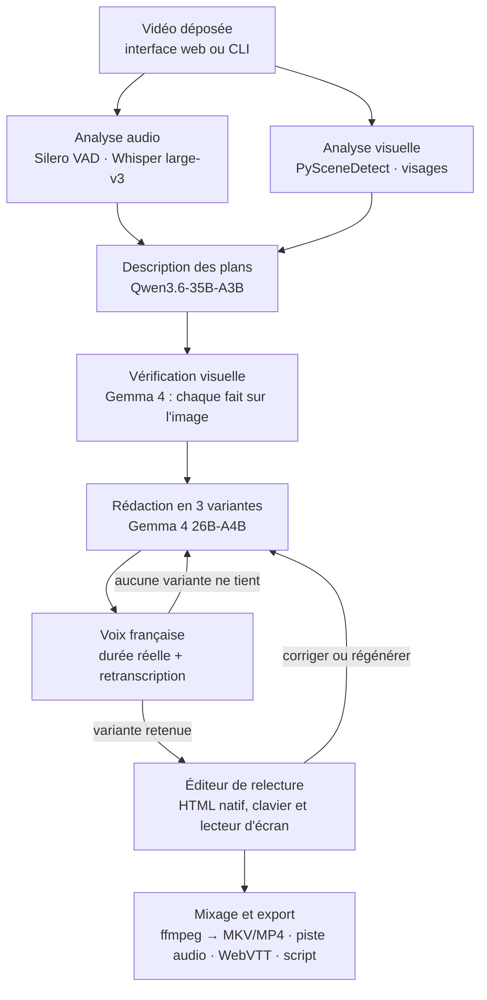

# Audesia — Brief projet

> Audiodescription automatique en français, 100 % locale, conçue pour l'ASUS Ascent GX10.
> Document de référence du dépôt : contexte du challenge, contraintes, architecture, backlog, puis dossier de candidature complet en annexe.
> Dernière mise à jour : 3 octobre 2026 (révision après revue technique : modèles, budget mémoire, méthode de preuve, périmètre, corpus, corrections du dossier).
> Nom du projet : **Audesia** (anciennement « Regard Sonore », renommé le 3 octobre 2026).

---

## 0. Contexte et échéances

Le projet est développé pour le **« ASUS Ascent GX10 – Local AI Developer Challenge »** (ASUS × Defend Intelligence, agence LoopIn).

| Date | Étape |
| --- | --- |
| 4 octobre 2026, 23h59 | Fin des candidatures (formulaire Gleam : 17 champs, dont une **vidéo de 2 min obligatoire**) |
| Juste après | Sélection de 8 projets, contactés par e-mail |
| Phase de test | Accès **à distance** à un GX10 pour développer, tester ou valider un élément du projet |
| Avant le 12 octobre 2026 | Remise des éléments de preuve (résultats, mesures, démo) |
| 12 octobre 2026 | Désignation du gagnant (lot : 1 GX10). Réponse à l'e-mail sous 72 h |

Source : règlement du challenge (Conditions Générales Gleam / ASUS). Ces modalités ne sont publiées nulle part ailleurs : en garder une copie. La durée de l'accès au GX10 n'est pas connue.

**Critères de présélection :** pertinence et innovation, qualité et faisabilité de l'approche, pertinence du GX10, potentiel de démonstration.

**Grille finale :**

| Critère | Poids |
| --- | --- |
| Pertinence et innovation | 30 % |
| Exécution et résultats démontrés | 30 % |
| Qualité technique et éléments de preuve | 20 % |
| Pertinence et validation de l'utilisation du GX10 | 20 % |

**Conséquence pour le code :** 70 % de la note porte sur la preuve. Tout doit être prêt et testé **avant** l'accès au GX10. L'accès distant ne sert qu'à lancer les calculs lourds et à collecter les mesures. Chaque exécution doit produire des métriques et des journaux exploitables dans le rapport. Le plan doit tenir si l'accès ne dure qu'une journée : tout ce qui ne dépend pas du GX10 (VAD, transcription, plans, images clés) est précalculé sur la 5080.

---

## 1. Contraintes non négociables

1. **100 % local.** Aucun appel réseau sortant à l'exécution (pas d'API cloud, pas de télémétrie). Les poids sont téléchargés une fois, puis tout tourne hors ligne.
   - pyannote 4 et vLLM envoient de la télémétrie par défaut. Toujours définir `PYANNOTE_METRICS_ENABLED=0 VLLM_NO_USAGE_STATS=1 DO_NOT_TRACK=1 HF_HUB_OFFLINE=1 HF_HUB_DISABLE_TELEMETRY=1`.
   - Preuve : la chaîne complète tourne dans un réseau Docker `internal: true` (aucune sortie possible) ; le log va dans le rapport.
2. **Deux profils matériels, même code :**
   - `small` : développement sur RTX 5080 (16 Go VRAM, x86_64, WSL2). Sert aussi de **baseline de comparaison** pour le dossier.
   - `large` : ASUS Ascent GX10 (GB10, 128 Go de mémoire unifiée, **ARM64 / aarch64**). Tous les modèles restent chargés en même temps.
   - Les deux profils partagent la même partie audio (VAD, transcription, voix) et les mêmes entrées précalculées. Seuls le modèle de vision, le rédacteur et le contexte changent.
3. **ARM64 dès le départ** (vérifié le 3 octobre 2026) :
   - Serveurs de modèles : image officielle `vllm/vllm-openai:v0.29.0` (arm64, CUDA 13.0), épinglée par digest. Les images NGC vLLM à partir de 26.04 ne démarrent pas sur le pilote R580 du GX10 ; NGC 26.02 en secours.
   - Workers : images construites nativement en arm64 (runners GitHub `ubuntu-24.04-arm`, gratuits pour un dépôt public, ou directement sur le GX10). Pas de test sous QEMU : l'émulation n'a pas de GPU.
   - Vérifier les roues aarch64 avant l'accès : `pip download -r requirements.txt --only-binary=:all: --platform manylinux_2_28_aarch64 --python-version 3.12`.
   - Éviter toute dépendance sans roue aarch64. CTranslate2 (faster-whisper, WhisperX) n'a pas de roue CUDA pour aarch64 : sur le GX10, il tourne sur le CPU sans prévenir.
4. **Tout mesurer.** Mémoire unifiée par étape, durée par étape, nombre de requêtes, tailles de batch. Logs JSON horodatés. Sur GB10, `nvidia-smi` affiche « Memory-Usage: Not Supported » et `docker stats` ne voit pas la mémoire CUDA : relever `/proc/meminfo`, `nvidia-smi --query-compute-apps` et les métriques vLLM (voir `scripts/bench_memory.sh`).
5. **Licences libres en priorité** (Apache 2.0, MIT, BSD). Signaler tout modèle non commercial (modèles InsightFace, XTTS-v2, poids F5-TTS, aligneur français par défaut de WhisperX) et créditer les contenus CC-BY (films Blender, doublages Touhoppai, modèle pyannote community-1).
6. **Jamais de description qui couvre un dialogue en mode standard.** Invariant testé automatiquement : 100 % contre la parole détectée (vrai par construction, test unitaire). La qualité de la détection se mesure à part, contre une vérité terrain (objectif > 95 %).
7. **Honnêteté technique :**
   - La bande passante du GX10 (~273 Go/s) est inférieure à celle de la 5080 (~960 Go/s). L'argument du projet est la **capacité mémoire**, pas la vitesse. Privilégier modèles MoE et traitement en lot (vLLM batching).
   - Raisonner en GiB : CUDA voit environ 119,7 GiB sur les 128 Go annoncés, et le plafond réaliste pour vLLM est d'environ 105 GiB.
   - Toute affirmation sur la qualité 16 Go vs 128 Go reste une hypothèse tant qu'elle n'est pas mesurée.

---

## 2. Environnement de développement

- Machine de dev : Windows + **WSL2 (bash)**, GPU **RTX 5080 16 Go**. Homebrew (linuxbrew) disponible.
- Docker avec support GPU sous WSL2 (NVIDIA Container Toolkit). Sur la 5080 (sm_120) : torch compilé pour CUDA 12.8 ou plus ; CTranslate2 en float16 (INT8 désactivé sur sm_120).
- Cible : GX10 accessible à distance (modalités communiquées par l'organisateur après sélection). Déploiement en une commande (`docker compose -f docker/compose.gx10.yml up`).
- Python 3.12. Pas de Node : la page de relecture est en HTML natif.
- **À demander aux organisateurs dès la sélection :** sortie de `nvidia-smi`, `/etc/dgx-release` et `df -h` ; accès sudo (nécessaire pour vider le cache de pages) ; accès internet pour télécharger les modèles ; durée de l'accès.

---

## 3. Structure de dépôt proposée

```
audesia/
├── AUDESIA.md                 # ce fichier
├── README.md                  # pitch, schéma, démarrage rapide, résultats, crédits CC-BY
├── LICENSE                    # Apache-2.0
├── configs/
│   ├── profile.small.yaml     # RTX 5080 (16 Go)
│   └── profile.large.yaml     # GX10 (128 Go)
├── prompts/
│   ├── describe.fr.md         # consigne VLM (description d'un plan)
│   ├── write.fr.md            # consigne rédacteur (Charte AD, 3 variantes, budget)
│   └── verify.fr.md           # consigne vérification : chaque fait est-il visible ?
├── backend/audesia/
│   ├── cli.py                 # audesia run <vidéo> --profile small|large
│   ├── api/                   # FastAPI minimal : routes JSON + page de relecture (HTML natif)
│   ├── pipeline/
│   │   ├── audio.py           # ffmpeg + Silero VAD + ASR → parole, dialogues, silences
│   │   ├── shots.py           # PySceneDetect → plans + images clés
│   │   ├── faces.py           # YuNet + SFace (prises de vues réelles) → personnages
│   │   ├── describe.py        # VLM → description brute par plan
│   │   ├── verify.py          # second modèle → faits validés sur les images
│   │   ├── write.py           # rédacteur → 3 variantes par silence
│   │   ├── tts.py             # voix FR + durée réelle + retranscription de contrôle
│   │   ├── fit_loop.py        # choix de la variante, nouvel essai, accélération, abandon
│   │   ├── mix.py             # ffmpeg : atténuation, pistes, exports
│   │   └── orchestrator.py    # enchaînement, reprise (étape sautée si sa sortie existe), jobs parallèles
│   ├── llm.py                 # client OpenAI-compatible (vLLM, llama.cpp, Ollama)
│   └── metrics.py             # chronos, marqueurs d'étape, export JSON
├── eval/
│   ├── overlap.py             # chevauchement : parole détectée et vérité terrain
│   ├── coverage.py            # couverture des silences, abandons, itérations, accélération
│   ├── judge.py               # juge VLM extérieur, comparaison par paires à l'aveugle
│   ├── hallucination_sample.py# mêmes 100 silences pour les deux profils, vérification humaine
│   └── report.py              # génère le rapport Markdown + graphiques
├── corpus/
│   └── download.sh            # vidéos, sous-titres, pistes musique + effets (vérité terrain)
├── scripts/
│   ├── bench_memory.sh        # relevé à 1 Hz sur l'hôte : /proc/meminfo, nvidia-smi --query-compute-apps
│   ├── fetch_models.sh        # téléchargements HF (avec exclusions), puis HF_HUB_OFFLINE=1
│   └── run_corpus.sh          # traite tout le corpus avec un profil
└── docker/
    ├── Dockerfile.worker      # une image par pile de dépendances incompatible si besoin
    ├── compose.dev.yml        # 5080 / WSL2
    └── compose.gx10.yml       # GX10 arm64 : serveurs vLLM + worker, réseau internal: true
```

---

## 4. Pipeline



### Étapes, entrées et sorties

| # | Étape | Entrée | Sortie (fichier du job) |
| --- | --- | --- | --- |
| 1 | Extraction | vidéo | `audio.wav` (16 kHz mono pour la VAD et l'ASR + piste originale), images |
| 2 | Analyse audio | `audio.wav` | `segments.json` : parole (VAD), dialogues (texte Whisper, locuteur si diarisation), silences utilisables |
| 3 | Plans | vidéo | `shots.json` : plans (début, fin), 3 à 8 images clés par plan. Seuls les plans qui recouvrent un silence utilisable (± une fenêtre) sont décrits |
| 4 | Personnages | images clés | `characters.json` : groupes de visages (prises de vues réelles) ou marquage visuel (animation) ; noms saisis dans l'éditeur |
| 5 | Description | plans + contexte | `raw_descriptions.json` : description factuelle par plan |
| 6 | Vérification | descriptions brutes + images clés | `facts.json` : faits élémentaires, validés ou rejetés sur les images |
| 7 | Rédaction | faits validés + silences | `descriptions.json` : 3 variantes par silence, budget en caractères |
| 8 | Voix + calage | variantes | `tts/*.wav`, durée réelle, retranscription ; variante retenue, sinon retour à 7 |
| 9 | Relecture | `descriptions.json` | versions corrigées (dans `descriptions.json`) |
| 10 | Export | tout | `out.mkv` (piste « fra – audiodescription » marquée `visual_impaired`), `out.mp4` et `out_ad.mp4` (lecteur web), `ad.mp3`, `ad.vtt`, `script.txt` |

### Schémas JSON (indicatifs)

```json
// segments.json
{ "speech":    [{"start": 12.30, "end": 15.20, "source": "vad"}],
  "dialogues": [{"start": 12.40, "end": 15.10, "speaker": "S1", "text": "..."}],
  "silences":  [{"start": 15.20, "end": 19.80, "usable": true}] }

// descriptions.json
{ "items": [{
    "id": "d_0007", "silence": {"start": 15.20, "end": 19.80},
    "shots": ["s_0012"], "facts": ["f_0031", "f_0032"],
    "variants": ["Sintel escalade une paroi enneigée, le souffle court.",
                 "Sintel escalade une paroi enneigée.",
                 "Sintel grimpe."],
    "text": "Sintel escalade une paroi enneigée.", "budget_chars": 48,
    "tts_duration": 2.9, "speedup": 1.0, "asr_check_wer": 0.0, "fits": true,
    "version": 2, "review": "pending" }] }
```

### Règles de calage

- Parole = segments de la VAD (Silero, seuil 0,35, marge de 200 ms) : dans le doute, c'est de la parole. Whisper ne fournit que le texte : sur Sintel, ses horodatages par segment débordaient sur la musique et effaçaient un silence de 51 s (mesuré le 4 octobre 2026).
- Silence utilisable : durée ≥ seuil configurable (par défaut 1,5 s), sans parole.
- Budget = (durée du silence − marges début/fin, par défaut 0,2 s chacune) × débit cible en **caractères par seconde**, à **calibrer sur la voix choisie** (plus fiable que le nombre de mots en français).
- Le rédacteur produit **3 variantes** (longue, moyenne, courte) en un seul appel. Les trois sont synthétisées en lot ; on garde la plus longue qui tient.
- Si aucune ne tient : nouvel appel avec la consigne de raccourcir (max N itérations), puis accélération légère de la voix (≤ 10 %, `atempo`), puis abandon de la description et signalement dans l'éditeur.
- Chaque clip est retranscrit par l'ASR déjà chargé ; un clip où des mots manquent ou se répètent est rejeté.
- Mode étendu (pause vidéo, WCAG 1.2.7) : après le challenge.

### Règles de rédaction (pour `prompts/write.fr.md`)

Dérivées de la *Charte de l'audiodescription* (2008) et du *Guide de l'audiodescription* de l'Arcom (2020) :

- Présent de l'indicatif, troisième personne, phrases courtes, vocabulaire simple et précis. Jamais « on voit » ni « nous voyons ».
- Décrire uniquement ce qui est visible : qui, quoi, où, quand. Pas d'interprétation des intentions, pas d'anticipation.
- N'utiliser que les faits validés par l'étape de vérification.
- Ne pas répéter ce que les dialogues ou les sons disent déjà.
- Nommer un personnage seulement si son nom a été prononcé ou affiché (ne pas anticiper) ; sinon une désignation stable (« la jeune femme au manteau rouge »).
- Lire les textes importants à l'écran (titres, panneaux, génériques).
- Tenir compte de ce qui a déjà été décrit pour éviter les répétitions.
- Terminer toute description commencée.
- Respecter strictement le budget fourni, en 3 variantes de longueurs différentes.
- Limite connue : la Charte demande aussi de ne jamais couvrir un son ou une musique signifiants. Pour l'instant, seule la parole est détectée.

---

## 5. Profils de configuration

```yaml
# configs/profile.large.yaml (GX10)
profile: large
resident_models: true          # tout reste chargé
vlm:
  model: Qwen/Qwen3.6-35B-A3B-FP8        # repli mémoire : nvidia/Qwen3.6-35B-A3B-NVFP4
  server: vllm
  max_images_per_shot: 8
  context_shots: 6             # mémoire des plans précédents
writer:                        # rédaction + vérification visuelle (voit les images)
  model: nvidia/Gemma-4-26B-A4B-NVFP4    # vérifier qu'il s'agit de la version instruct ; sinon unsloth/gemma-4-26B-A4B-it-NVFP4
  server: vllm
asr: { vad: silero, model: whisper-large-v3 }          # identique au profil small
tts: { engine: à choisir par comparatif, language: fr, chars_per_second: à calibrer }
fit: { min_silence_s: 1.5, margin_s: 0.2, variants: 3, max_iterations: 3, max_speedup: 1.10 }
parallel_jobs: 2
```

```yaml
# configs/profile.small.yaml (RTX 5080, baseline)
profile: small
resident_models: false         # ASR déchargé avant la description ; rédacteur + voix chargés ensemble (~12 Go)
vlm:    { model: gemma4:12b-it-qat, server: ollama, max_images_per_shot: 4, context_shots: 2 }  # ou llama.cpp : ggml-org/gemma-4-12B-it-GGUF ; repli : Qwen/Qwen3.5-9B
writer: { model: même modèle que le VLM }
asr:    { vad: silero, model: whisper-large-v3 }       # identique au profil large
tts:    { même moteur et même voix que le profil large }
fit:    { identique au profil large }
parallel_jobs: 1
```

**Balayage de modèles (GX10 uniquement, chargés un par un à la place du modèle principal) :**

| Rôle | Candidat | Poids |
| --- | --- | --- |
| Vision | Qwen3.5-122B-A10B NVFP4 (`nvidia/Qwen3.5-122B-A10B-NVFP4`) | ~78 GiB |
| Rédaction | gpt-oss-120b MXFP4 (`openai/gpt-oss-120b`) | ~61 GiB |
| Rédaction | Mistral Small 4 NVFP4 (`mistralai/Mistral-Small-4-119B-2603-NVFP4`) | ~66 GiB |
| Rédaction | Gemma 4 31B (`google/gemma-4-31B-it-qat-w4a16-ct`) | ~17 GiB (estimé) |

Juge de qualité : un VLM absent des chaînes comparées (par défaut Qwen3.5-122B-A10B, lancé après les runs).

Identifiants vérifiés sur Hugging Face le 3 octobre 2026 ; versions plus récentes acceptées si elles tiennent dans le même budget mémoire. Gemma 4 12B est servi avec la vision par Ollama (`gemma4:12b-it-qat`) et par llama.cpp (`ggml-org/gemma-4-12B-it-GGUF`, fichier `mmproj` inclus).

---

## 6. Backlog priorisé

### P0 — Avant l'envoi de la candidature (4 octobre, 23h59)

- [ ] Reporter dans Gleam les réponses corrigées de l'annexe A10 ; tourner la vidéo selon A11.
- [x] Dépôt `swinn37/AudesIA` créé avec README, licence et premiers résultats. Privé pour l'instant : à rendre public pour que le lien du formulaire s'ouvre.
- [x] Script CLI minimal, **en un seul fichier** (`audesia_p0.py`, lancé le 4 octobre sur la 5080, résultats au §7), sur un extrait de 1 à 2 min de Sintel ou Sprite Fright en version française, profil `small` :
  - Silero VAD → Whisper large-v3 (transformers, même code que sur le GX10) → PySceneDetect → VLM via un serveur compatible OpenAI (Ollama `gemma4:12b-it-qat`, llama.cpp ou vLLM) → réécriture en 3 variantes avec budget → Qwen3-TTS → mixage ffmpeg ;
  - coder contre l'API OpenAI : passer au GX10 ne doit demander qu'un changement de configuration.
- [x] Exporter l'extrait avec et sans audiodescription pour la vidéo de présentation (`clip.mp4`, `clip_ad.mp4`).
- [ ] (Optionnel) Maquette statique de la page de relecture.

### P1 — Après la sélection, avant l'accès au GX10

- [ ] Envoyer aux organisateurs les questions du §2 (pilote, sudo, internet, disque, durée).
- [ ] Pipeline modulaire (`pipeline/*`) : un fichier JSON par étape, reprise sur erreur (une étape est sautée si sa sortie existe).
- [ ] Parole = VAD seule, seuil et marge réglés contre la vérité terrain ; même ASR sur les deux profils pour le texte, sans compiler CTranslate2 (Whisper large-v3 via transformers, ou Qwen3-ASR-1.7B).
- [ ] Rédaction en 3 variantes + `fit_loop.py` + tests unitaires de l'invariant « aucun chevauchement avec la parole détectée ».
- [ ] Vérification visuelle (`verify.py`, `prompts/verify.fr.md`) : faits élémentaires validés un par un sur les images clés par le second modèle.
- [ ] Comparatif de voix sur ~30 phrases d'audiodescription :
  - candidats : Qwen3-TTS-1.7B, Chatterbox V3 (commit épinglé), VoxCPM2 ;
  - critères : erreur de retranscription, écoute, vitesse ;
  - Chatterbox 0.1.7 est à éviter : torch 2.6 sans support RTX 50xx, plantage sur les textes ≤ 5 tokens.
- [ ] Personnages : YuNet + SFace sur les prises de vues réelles ; pour l'animation, marquage visuel (un cercle de couleur par personnage) avant la description ; noms saisis dans l'éditeur.
- [ ] Page de relecture en HTML natif servie par FastAPI : tableau accessible (horodatage, texte modifiable, durée voix / durée silence, Écouter, Régénérer), lecteur avec/sans AD qui bascule entre deux MP4.
- [ ] Profils `small` / `large` ; serveurs vLLM via compose (image `vllm/vllm-openai:v0.29.0` épinglée par digest).
- [ ] Images worker arm64 construites nativement (runners GitHub `ubuntu-24.04-arm`) ; roues vérifiées avec `pip download --platform`.
- [ ] Instrumentation : `metrics.py` + `scripts/bench_memory.sh` (relevé à 1 Hz sur l'hôte, marqueurs d'étape).
- [ ] Preuve hors ligne : run complet dans un réseau Docker `internal: true`, variables anti-télémétrie actives.
- [ ] Scripts d'évaluation (`eval/*`) et génération du rapport.
- [ ] Corpus et vérité terrain (§7) ; précalcul sur la 5080 de la VAD, de la transcription, des plans et des images clés.
- [ ] Run complet du corpus en profil `small` → résultats de référence archivés.

### P2 — Pendant l'accès au GX10

- [ ] Jour 1 (doit suffire à lui seul) :
  - `scripts/fetch_models.sh`, vidage du cache de pages, démarrage des serveurs un par un, relevé mémoire réel ;
  - run complet du corpus avec la configuration principale ;
  - mesures clés : chevauchement contre vérité terrain, couverture, temps, mémoire ;
  - A/B rapide du rédacteur sur 20 à 30 silences.
- [ ] Jour 2 : plusieurs vidéos en parallèle (débit).
- [ ] Jour 3 : balayage de modèles de classe 120B (§5), juge VLM extérieur, ablations (sans contexte, sans personnages).
- [ ] Jour 4 : rapport, vidéo de démo, publication.
- [ ] Plan B si mémoire insuffisante : versions NVFP4, contexte réduit, `--max-num-seqs` plus bas.

### P3 — Après le challenge

- [ ] Tests avec des utilisateurs aveugles/malvoyants (Fédération des Aveugles de France, association Valentin Haüy).
- [ ] Mode étendu (pause vidéo, WCAG 1.2.7).
- [ ] Nommage automatique des personnages ; détection des sons signifiants.
- [ ] File de jobs (Redis/RQ), base de données, frise visuelle avec forme d'onde : seulement si le besoin apparaît (multi-utilisateur, utilisateurs voyants).
- [ ] Extension PeerTube / lecteurs web, export LMS, export direct vers YouTube (pistes d'audiodescription).
- [ ] Mode questions-réponses à la demande sur la scène en cours.
- [ ] Autres langues, version installable clés en main.

---

## 7. Mesures et critères de réussite

| Mesure | Définition | Objectif |
| --- | --- | --- |
| Chevauchement (parole détectée) | % de descriptions dont [début, début + durée voix] n'intersecte aucune parole détectée | 100 % (invariant, test unitaire) |
| Chevauchement (vérité terrain) | Même mesure contre le masque de parole issu des pistes musique + effets et des sous-titres | > 95 % |
| Couverture | % des secondes de silence utilisable portant une description | À mesurer et comparer |
| Calage | % de descriptions abandonnées, itérations moyennes, accélération moyenne | À mesurer |
| Qualité | Grille 1-5 : exactitude, pertinence, cohérence des personnages, concision. Juge VLM absent des chaînes comparées, comparaison par paires à l'aveugle sur les mêmes silences, échantillon humain | Gain net du profil `large` |
| Hallucinations | Vérification humaine des mêmes 100 silences tirés au hasard, pour les deux profils | Taux mesuré et comparé |
| Voix | Taux d'erreur de retranscription des clips | À mesurer |
| Temps de traitement | minutes de calcul / minute de vidéo | À mesurer, cible < 5 |
| Mémoire maximale | Relevé à 1 Hz sur l'hôte, par étape (`/proc/meminfo`, `nvidia-smi --query-compute-apps`, métriques vLLM) | ≤ ~105 GiB, marge mesurée |
| Débit | vidéos traitées simultanément sans dégradation | ≥ 2 |
| Hors ligne | run complet dans un réseau Docker sans sortie | Réussi |

**Livrables pour l'organisateur :** rapport chiffré, journaux et relevés mémoire, extraits avant/après, comparaison GX10 vs 5080, courbe taille de modèle / qualité, log du run hors ligne, dépôt GitHub public.

**Premier résultat** (4 octobre 2026, RTX 5080, Sintel 1:35–3:35, mesuré avec `eval/overlap.py`) :
- 16 descriptions sur 16 sans chevauchement des paroles ;
- 14 sur 16 sans chevauchement d'aucune voix (deux éclats vocaux de moins de 0,7 s) ;
- couverture des silences de 64 % ;
- environ 3 min de calcul par minute de vidéo.

### Corpus et vérité terrain

Le corpus initial (Sintel, Tears of Steel, Spring) ne contenait qu'environ 3,5 min de dialogue, tout en anglais, et Spring n'en a aucun. Corpus retenu (~42 min, 71 % en français, ~13,6 min de parole, sous-titres horodatés pour tout) :

| Vidéo | Durée | Licence | Intérêt |
| --- | --- | --- | --- |
| [Tears of Steel](https://download.blender.org/demo/movies/ToS/) (VO anglaise) | 12:14 | CC BY 3.0 | Acteurs réels ; la piste musique + effets sans dialogues donne un masque de parole exact (fichiers son BY-ND : évaluation uniquement, pas de redistribution de dérivé) |
| [Sprite Fright, version française](https://peertube.touhoppai.moe/w/9HXS5EWh4TNKME8tyVFCne) (Touhoppai) | 10:30 | CC BY 4.0 | Dialogues de groupe en français, 6 personnages récurrents, VTT français |
| [Pepper&Carrot, épisode 6, VF](https://peertube.touhoppai.moe/w/rSSkd86E2C4ikCCwewZUsZ) | 7:37 | CC BY-SA 4.0 | Cas difficile : 51 % de parole, narrateur, visages 2D. La version audiodécrite sera aussi en BY-SA |
| [Le trésor de Sidiailles](https://film.k-prod.fr/w/6k27hDT7PbR2oZNoGrsPjc) (Kintésens) | 11:56 | CC BY (métadonnées PeerTube) | Prises de vues réelles en français. Licence à faire confirmer par écrit. Enfants à l'écran : ne publier aucun recadrage de visage |

- Secours : [Sintel, version française](https://peertube.touhoppai.moe/w/tZbHhmpfbC8vt2rw871P7A) (continuité avec la vidéo de présentation ; piste musique + effets disponible pour la VO) ; « HATTILA et le visiteur du passé » si la licence de Sidiailles n'est pas confirmée.
- Témoin sans dialogue : Spring.
- Référence de qualité : Elephants Dream, avec les audiodescriptions textuelles humaines de Silvia Pfeiffer (anglais, CC BY 4.0).
- À exclure : Agent 327 (CC BY-ND).
- Vérité terrain : masque de parole issu des pistes musique + effets (Tears of Steel, Sintel) et des sous-titres horodatés ; annotation manuelle de quelques minutes pour les vidéos françaises si besoin.

---

# ANNEXE — Dossier de candidature complet

## A1. Résumé exécutif

Audesia génère automatiquement une piste d'audiodescription en français pour n'importe quelle vidéo, entièrement en local sur un ASUS Ascent GX10. L'outil repère les silences entre les dialogues, décrit ce qui se passe à l'écran avec un modèle de vision, vérifie chaque détail sur l'image, réécrit chaque description pour qu'elle tienne dans le silence disponible, puis la fait lire par une voix de synthèse mixée avec la bande-son.

- **Pour qui :** associations, médiathèques, organismes de formation, collectivités, créateurs vidéo et chaînes qui doivent rendre leurs vidéos accessibles sans budget d'audiodescription professionnelle.
- **Pourquoi en local :** les vidéos traitées (formations internes, archives, contenus non publiés) ne quittent jamais la machine, et le coût par heure de vidéo devient quasi nul.
- **Pourquoi le GX10 :** la chaîne complète (vision, rédaction, parole, voix) reste chargée en mémoire en permanence, avec de la place pour plusieurs vidéos en parallèle et pour comparer des modèles de classe 120B. Sur une carte grand public de 16 Go, il faut des modèles nettement plus petits, en partie chargés l'un après l'autre.
- **Ce qui sera validé sur le GX10 :** la mémoire réellement utilisée, la qualité des descriptions avec de grands modèles face à la version 16 Go, le respect des silences mesuré contre une vérité terrain (objectif : plus de 95 % des descriptions sans chevauchement de dialogue), la part des silences couverte et le temps de traitement par minute de vidéo.
- **Où en est le projet :** un prototype complet tourne sur RTX 5080. Sur un extrait de Sintel, ses 16 descriptions sont toutes placées sans chevaucher les paroles, mesuré contre la piste musique + effets officielle du film.
- **Livrable :** un dépôt open source, une démo web et des vidéos libres audiodécrites automatiquement.

## A2. Problème et contexte

L'audiodescription reste l'exception. Selon la Fédération des aveugles et amblyopes de France, seulement 4 % des programmes de télévision sont audiodécrits ([chiffre repris dans une question écrite à l'Assemblée nationale, 2024](https://questions.assemblee-nationale.fr/dyn/16/questions/QANR5L16QE14921)). En ligne, elle reste rare : YouTube n'a ouvert le dépôt de pistes d'audiodescription à toutes les chaînes éligibles qu'en septembre 2026.

- **Le public concerné est large.** Près de 1,7 million de personnes ont une déficience visuelle en France, dont 207 000 aveugles ou malvoyants profonds et 932 000 malvoyants moyens (DREES, 2005, d'après l'enquête HID de 1998-2000). Avec le vieillissement de la population, ce chiffre va augmenter.
- **La production humaine ne passe pas à l'échelle.** Une audiodescription professionnelle demande un auteur spécialisé, un comédien, un studio et un mixage. C'est justifié pour un film de cinéma, pas pour une vidéo de formation, un cours en ligne ou la chaîne YouTube d'une association.
- **Le cadre réglementaire se durcit.**
  - Les WCAG (critère 1.2.5, niveau AA) et le RGAA (critère 4.5) demandent une audiodescription synchronisée pour les vidéos préenregistrées, si nécessaire.
  - Depuis juin 2025, l'European Accessibility Act oblige les services donnant accès à des contenus audiovisuels à transmettre l'audiodescription quand elle existe. L'obligation d'en produire relève de la directive SMA et de l'Arcom.
- **Les solutions IA existantes passent par le cloud.** Certaines gèrent déjà le français, mais toutes obligent à envoyer ses vidéos chez un prestataire, souvent américain, ce qui bloque les contenus internes, non publiés, sensibles ou soumis au RGPD.

## A3. Solution et cas d'usage

On dépose une vidéo dans l'interface web ; quelques minutes plus tard, on récupère une piste d'audiodescription française synchronisée, relue et corrigeable avant export.

1. Repérage des dialogues et des silences utilisables.
2. Découpage en plans et reconnaissance des personnages d'un plan à l'autre.
3. Description de chaque plan avec un grand modèle de vision, en tenant compte de ce qui a déjà été décrit, puis vérification de chaque fait sur l'image par un second modèle.
4. Réécriture selon les règles de l'audiodescription et calage dans le silence disponible, en mesurant la durée réelle de la voix.
5. Génération de la voix, mixage avec la bande-son, export.
6. Relecture, correction ou régénération par un humain avant export.

**Formats de sortie :** MKV/MP4 avec piste audio « audiodescription » séparée et marquée pour les personnes malvoyantes, piste audio seule (téléversable comme piste d'audiodescription sur YouTube), WebVTT de descriptions, script texte.

| Utilisateur | Contenu | Ce que ça change |
| --- | --- | --- |
| Association, médiathèque | Vidéos de présentation, films libres, archives | Accessibilité sans budget de studio |
| Université, organisme de formation | Cours filmés, MOOC, tutoriels | Mise en conformité RGAA de catalogues entiers |
| Collectivité, service public | Vidéos institutionnelles, conseils municipaux | Conformité sans envoyer de données hors de l'organisation |
| Entreprise | Formations internes, onboarding, vidéos de sécurité | Contenus confidentiels traités sur site |
| Créateur vidéo | YouTube, vidéos courtes | Nouvelle audience, en quelques minutes |

**Mode standard :** les descriptions tiennent dans les silences. Un mode étendu, où la vidéo se met en pause quand une description indispensable ne trouve pas de place (WCAG 1.2.7, niveau AAA), est prévu après le challenge.

## A4. Back-end et front-end

| Brique | Choix | Rôle |
| --- | --- | --- |
| API | Python 3.12, FastAPI minimal | Dépôt, suivi des jobs, édition, export |
| Progression | Sondage de `GET /jobs/{id}` | Avancement étape par étape |
| Jobs | Pool de jobs dans le processus ; reprise par les fichiers JSON de chaque étape | Plusieurs vidéos en parallèle, reprise après erreur |
| Inférence | vLLM (GX10), llama.cpp (5080), API compatible OpenAI | Sert le modèle de vision et le rédacteur, avec batching sur le GX10 |
| Workers audio | Silero VAD, Whisper large-v3, voix française | Parole, silences, voix |
| Médias | ffmpeg | Extraction, découpe, mixage avec atténuation, encodage, multiplexage |
| Données | Un dossier par job, un fichier JSON par étape | Jobs, segments, descriptions et versions |
| Supervision | Logs JSON + relevé mémoire à 1 Hz sur l'hôte | Mémoire et charge par étape |
| Déploiement | Docker Compose, image vLLM officielle arm64 (CUDA 13.0), workers construits nativement en arm64 | Installation en une commande sur un GX10 |

Pas de Redis, de WebSocket ni de base de données pour le challenge : ils n'apportent rien à la preuve. À ajouter seulement si l'outil devient multi-utilisateur.

**Modèle de données :**
- Un *Job* est un dossier (vidéo, paramètres, état) avec un fichier JSON par étape.
- Les *Segments* (parole, silence, plan) sont dans `segments.json` et `shots.json`.
- Chaque silence utilisable peut porter une *Description* versionnée dans `descriptions.json` : variantes, texte retenu, durée réelle de la voix, statut de relecture.

| Méthode | Route | Usage |
| --- | --- | --- |
| POST | `/jobs` | Déposer une vidéo, choisir la voix et le niveau de détail |
| GET | `/jobs/{id}` | État et progression (sondage) |
| GET | `/jobs/{id}/descriptions` | Descriptions et horodatages |
| PATCH | `/descriptions/{id}` | Corriger un texte |
| POST | `/descriptions/{id}/regenerate` | Régénérer une description |
| GET | `/jobs/{id}/export?format=mkv\|mp4\|mp3\|vtt\|txt` | Télécharger le résultat |

**Front-end :** une page HTML native servie par l'API, sans framework.
- **Dépôt :** voix, niveau de détail.
- **Relecture :** tableau accessible avec horodatage, texte modifiable, durée voix / durée silence écrite en clair, boutons Écouter et Régénérer, raccourcis clavier.
- **Démonstration :** lecteur avec/sans AD qui bascule entre deux fichiers MP4 en conservant la position, car les navigateurs ne savent pas changer de piste audio.

L'interface est utilisable au clavier et au lecteur d'écran, pour que des créateurs aveugles puissent valider leurs descriptions. Une frise visuelle (forme d'onde) pourra s'ajouter plus tard pour les utilisateurs voyants.

## A5. Modèles et technologies

| Rôle | Modèle retenu | Licence | Alternative |
| --- | --- | --- | --- |
| Compréhension visuelle | Qwen3.6-35B-A3B (MoE, FP8) | Apache 2.0 | Qwen3.5-122B-A10B (NVFP4, balayage GX10) |
| Rédaction et vérification visuelle | Gemma 4 26B-A4B (MoE, NVFP4) | Apache 2.0 | gpt-oss-120b, Mistral Small 4, Gemma 4 31B (balayage GX10) |
| Vision + rédaction, profil 16 Go | Gemma 4 12B (QAT 4 bits) | Apache 2.0 | Qwen3.5-9B |
| Détection de parole | Silero VAD (paquet `silero-vad`) | MIT | pyannote segmentation |
| Transcription | Whisper large-v3 (transformers ; faster-whisper sur x86) | MIT | Qwen3-ASR-1.7B (Apache 2.0) |
| Diarisation (optionnelle) | pyannote community-1 | CC-BY-4.0 (attribution ; télémétrie à couper) | — |
| Découpage en plans | PySceneDetect | BSD-3 | TransNetV2 (MIT) |
| Personnages | YuNet + SFace (prises de vues réelles) ; marquage visuel par le VLM (animation) | MIT / Apache 2.0 | InsightFace (modèles non commerciaux, exclu) |
| Voix française | Choix par comparatif : Qwen3-TTS-1.7B, Chatterbox V3, VoxCPM2 | Apache 2.0 / MIT / Apache 2.0 | Kyutai TTS (CC-BY-4.0) ; exclus : XTTS-v2, F5-TTS (non commerciaux) |
| Service des modèles | vLLM, llama.cpp, PyTorch | Apache 2.0 / MIT / BSD | TensorRT-LLM |
| Médias | ffmpeg | LGPL / GPL | — |

**Vérifié le 3 octobre 2026 :**
- Les images NGC vLLM à partir de 26.04 sont incompatibles avec le pilote R580 : utiliser `vllm/vllm-openai:v0.29.0` (CUDA 13.0).
- CTranslate2 n'a pas de version GPU pour aarch64.
- Chatterbox 0.1.7 épingle torch 2.6 (sans support RTX 50xx) et plante sur les textes ≤ 5 tokens.
- pyannote 4 et vLLM envoient de la télémétrie par défaut.
- L'aligneur français par défaut de WhisperX est non commercial.

**Reste à vérifier sur la machine :** version du pilote, accès sudo et internet, espace disque.

## A6. Pourquoi en local, et pourquoi le GX10

Le GX10 garde toute la chaîne en mémoire en permanence, avec de la place pour plusieurs vidéos en parallèle et pour comparer des modèles de classe 120B. C'est une des rares machines de bureau à réunir 128 Go de mémoire unifiée et toute la pile CUDA (vLLM, FP4 Blackwell). Son avantage est la capacité mémoire, pas la vitesse brute.

- **Confidentialité :** formations internes, archives familiales, vidéos avec des mineurs ou des patients ne quittent jamais la machine.
- **Coût :** pas de facturation à la minute ; audiodécrire un catalogue entier ne coûte que l'électricité.
- **Souveraineté :** pas de dépendance à une API qui change de prix ou disparaît.

| Composant chargé en permanence | Mémoire estimée |
| --- | --- |
| Vision : Qwen3.6-35B-A3B FP8 | ~35 GiB |
| Rédaction + vérification : Gemma 4 26B-A4B NVFP4 | ~15 GiB |
| VAD, transcription, voix, visages, découpage | ~8 GiB |
| Caches KV et runtimes vLLM (2 serveurs, 2 à 3 vidéos en parallèle) | ~15 GiB |
| **Total estimé** | **~75 GiB sur ~119,7 GiB visibles (plafond réaliste ~105 GiB)** |

Ces chiffres sont des estimations à confirmer par la mesure.
- La marge restante sert à traiter plusieurs vidéos en parallèle.
- Le balayage charge à la place des modèles de classe 120B : Qwen3.5-122B-A10B (NVFP4, ~78 GiB) en vision, gpt-oss-120b (~61 GiB) ou Mistral Small 4 (NVFP4, ~66 GiB) en rédaction.
- Le projet choisit ainsi ses modèles par la mesure, pas selon ce qui rentre en mémoire.

| | RTX 5080 (16 Go) | ASUS Ascent GX10 (128 Go) |
| --- | --- | --- |
| Modèle de vision | Gemma 4 12B, 4 bits | Qwen3.6-35B-A3B FP8, jusqu'à 122B en balayage |
| Rédacteur | Le même modèle | Gemma 4 26B-A4B dédié, jusqu'à 120B en balayage |
| Chargement | ASR déchargé avant la description | Tout reste en mémoire |
| Contexte vidéo | 4 images par plan, 2 plans de contexte | 8 images par plan, 6 plans de contexte |
| Vidéos en parallèle | Une seule | 2 à 3 (batching vLLM) |

**Point d'honnêteté :**
- La bande passante du GX10 est d'environ 273 Go/s, contre environ 960 Go/s pour la 5080. Sur un petit modèle seul, la 5080 est plus rapide. Le projet exploite donc des modèles MoE et du traitement en lot plutôt qu'une conversation temps réel.
- Avec assez de RAM système, llama.cpp peut aussi faire tourner de gros modèles MoE sur la 5080 en déportant une partie des experts sur le CPU, mais lentement et un seul à la fois.
- La différence de qualité entre 16 Go et 128 Go est une hypothèse que le test doit mesurer.

## A7. Concurrence

Le lancement de Google ne vise pas le même problème : **Guided Vision** décrit en direct ce que filme la caméra du téléphone, il ne produit pas de piste d'audiodescription pour une vidéo. Les concurrents directs sont des services cloud, dont certains gèrent déjà le français.

**Google Guided Vision (Gemini Live), lancé le 1er octobre 2026** ([annonce Google](https://blog.google/innovation-and-ai/products/gemini-app/guided-vision-gemini-live/)) :
- L'utilisateur partage la caméra de son téléphone Android ; Gemini décrit l'environnement à voix haute, répond aux questions et guide le cadrage. Le modèle a été développé avec Aira, entraîné sur des dizaines de milliers d'heures d'interprétation visuelle, et testé par plus de 1 000 membres du réseau de testeurs d'Aira.
- Usages : lire une étiquette ou un cadran, retrouver un objet, décrire une pièce ou une tenue. Google précise que ce n'est ni une aide à la navigation ni un détecteur d'obstacles.
- Pour Audesia : complémentaire, pas concurrent (monde réel en direct via le cloud vs vidéos enregistrées, piste synchronisée, relue, exportable, en local).
- Risque : une audiodescription automatique intégrée à YouTube, qui resterait limitée aux vidéos YouTube et au cloud. À ce jour, YouTube accepte les pistes d'audiodescription téléversées (depuis le 4 septembre 2026) mais n'en génère pas : c'est un débouché pour Audesia.

| Acteur | Type | Ce qu'il fait | Limite face à Audesia |
| --- | --- | --- | --- |
| [ViddyScribe](https://viddyscribe.com/) | SaaS cloud | AD IA standard et étendue, 98 langues dont le français, exports VTT/SRT/audio/vidéo, intégrations YouTube, Vimeo, Panopto, Kaltura, Brightcove, API | Cloud, abonnement |
| [Verbit](https://verbit.ai/ai-audio-description/) | SaaS cloud + humains | AD IA synchronisée, WCAG 1.2.5, relecture humaine en option, livraison en 24 à 48 h | Cloud |
| [3Play Media](https://www.freelock.com/advent/2025/12-whats-happening-on-screen-audio-description-videos) | Service | AD par IA (script et voix) ou rédigée par des humains, AD étendue, français disponible | Cloud, prestation payante |
| Audible Sight | SaaS cloud | AD IA, plus de 100 voix de synthèse, paiement à l'usage | Cloud |
| [YouDescribe](https://www.freelock.com/advent/2025/12-whats-happening-on-screen-audio-description-videos) | Communautaire | Descriptions pour YouTube ; depuis 2025, brouillons IA relus par des bénévoles, placés automatiquement et lus par une voix de synthèse | Limité à YouTube |
| [ViDscribe](https://arxiv.org/abs/2603.14662) | Recherche (CHI 2026, Extended Abstracts) | AD par LLM multimodal pour YouTube, personnalisable, questions-réponses ; étude avec 8 participants aveugles ou malvoyants | Prototype, cloud |
| [ADCanvas](https://research.google/pubs/adcanvas-accessible-and-conversational-audio-description-authoring-for-blind-and-low-vision-creators/) | Recherche CMU / Google (CHI 2026) | Outil de rédaction d'AD pour créateurs aveugles, assisté par IA ; étude avec 12 créateurs | Prototype |
| Studios d'audiodescription | Prestation humaine | Qualité de référence cinéma/TV | Coût et délais incompatibles avec le volume |

Aucune offre française d'audiodescription par IA en local ou sur site n'a été identifiée (Authôt fait de la transcription et du sous-titrage, Voxygen de la synthèse vocale). Les outils cloud gèrent déjà le français : la différence d'Audesia tient au local, au respect des normes françaises d'audiodescription, à la relecture accessible et à l'open source.

**Recherche :**
- La chaîne « modèle de vision → modèle de langage » est établie dans la littérature :
  - [AutoAD-II](https://arxiv.org/abs/2310.06838) place les descriptions dans les pauses et utilise une banque de personnages ;
  - [AutoAD-Zero](https://arxiv.org/abs/2407.15850) marque chaque personnage d'un cercle de couleur sur l'image avant de le décrire ;
  - [Shot-by-Shot](https://arxiv.org/abs/2504.01020) tient compte de la grammaire du film.
- En 2026, [« What, When, and How »](https://arxiv.org/abs/2609.30121) montre que les LLM dépassent le débit visé dans 17 à 29 % des cas, ce qui justifie de mesurer la durée réelle de la voix.
- Aucun système ni corpus d'audiodescription en français n'a été trouvé ; [SwissADT](https://arxiv.org/abs/2411.14967) ne fait que traduire des scripts.

## A8. Différenciation

- **Local et souverain :** aucune vidéo ne sort de la machine, et un test sans réseau le prouve.
- **Pensé pour le français :** consignes de rédaction dérivées de la Charte de l'audiodescription (2008) et du Guide de l'audiodescription de l'Arcom (2020), voix française choisie par comparatif.
- **Cohérence narrative :** personnages suivis d'un plan à l'autre, mémoire de ce qui a déjà été décrit.
- **Vérification visuelle :** chaque fait est validé sur l'image par un second modèle, d'une autre famille.
- **Calage mesuré :** la durée réelle de la voix est mesurée plutôt qu'estimée, et aucune description ne chevauche la parole détectée.
- **L'humain garde la main :** éditeur accessible pour valider chaque phrase.
- **Open source et déployable sur site :** pas de coût à la minute.

## A9. Risques

| Risque | Parade |
| --- | --- |
| Le modèle de vision invente des éléments | Vérification visuelle fait par fait par un second modèle d'une autre famille, consigne « ne décrire que le visible », relecture humaine |
| Personnages confondus ou mal nommés | Visages regroupés sur toute la vidéo (prises de vues réelles), marquage visuel pour l'animation, noms seulement s'ils sont prononcés ou affichés, correction dans l'éditeur |
| Mémoire insuffisante | Configuration principale estimée à ~75 GiB ; versions NVFP4 ; contexte réduit |
| Incompatibilités ARM64 | Image vLLM officielle CUDA 13.0 (compatible pilote R580), workers construits nativement en arm64, roues vérifiées avant l'accès |
| Détection de parole imparfaite (musique, chants) | VAD sensible avec marge, réglée et mesurée contre une vérité terrain (pistes musique + effets) |
| Voix peu naturelle ou qui saute des mots | Comparatif de 3 moteurs, retranscription de contrôle de chaque clip |
| Licences incompatibles | Apache 2.0 / MIT en priorité ; aligneur non commercial de WhisperX évité ; attribution CC-BY (pyannote community-1, films Blender) |
| Télémétrie cachée | Variables d'environnement + run complet dans un réseau Docker sans sortie |
| Phase de test très courte | Tout prêt avant l'accès, plan tenable en une journée, entrées précalculées |

## A10. Réponses au formulaire Gleam

*Réponses définitives une fois envoyées. Date limite : 4 octobre 2026, 23h59.*

**Champs personnels :** prénom, nom, e-mail, téléphone, ville, LinkedIn (facultatif), entreprise/organisation (facultatif).

**Métier / Fonction (exemple à adapter) :** Développeur, passionné d'IA locale et de traitement vidéo (ffmpeg, encodage GPU, pipelines de conversion VR).

**Nom du projet :** Audesia

**Description du projet :**
Audesia génère automatiquement une audiodescription en français pour n'importe quelle vidéo, 100 % en local. En France, 1,7 million de personnes ont une déficience visuelle (DREES), mais l'audiodescription reste l'exception : environ 4 % des programmes télévisés selon la Fédération des aveugles de France, et elle est rare en ligne. La production humaine est trop chère pour les cours, vidéos d'associations, formations ou contenus institutionnels, et les outils IA existants imposent d'envoyer ses vidéos dans le cloud. Audesia détecte les silences entre les dialogues, décrit chaque plan avec un modèle de vision, vérifie chaque détail sur l'image, réécrit les descriptions pour qu'elles tiennent dans les silences en mesurant la durée réelle de la voix, puis génère une voix française mixée à la bande-son. Un éditeur accessible permet de relire et corriger avant export (vidéo, piste audio, WebVTT). Cible : associations, médiathèques, universités, collectivités et créateurs, avec un outil open source installable sur site.

**Domaine IA concerné :** Computer Vision (le cœur du projet est la compréhension vidéo ; « IA générative » est aussi défendable).

**Modèles, frameworks ou technologies IA utilisées :**
Qwen3.6-35B-A3B (modèle de vision MoE) pour la compréhension des plans ; Gemma 4 26B-A4B pour la rédaction et la vérification visuelle des descriptions ; comparaison sur le GX10 avec des modèles de classe 120B (Qwen3.5-122B-A10B, gpt-oss-120b, Mistral Small 4) ; Silero VAD et Whisper large-v3 pour la parole et les silences ; PySceneDetect et embeddings de visages pour les plans et les personnages ; voix française open source choisie par comparatif (Qwen3-TTS, Chatterbox, VoxCPM2) ; vLLM et PyTorch pour le service des modèles ; Docker sur ARM64 ; ffmpeg pour les médias ; FastAPI pour l'application.

**État d'avancement :** « Prototype initial » : la chaîne complète tourne sur la RTX 5080 depuis le 4 octobre 2026.

**Test & validation sur ASUS Ascent GX10 :**
Je veux valider que la chaîne complète d'audiodescription tourne en local avec tous ses modèles chargés en même temps : modèle de vision MoE de 35B, rédacteur de 26B qui vérifie aussi chaque fait sur l'image, détection de parole, transcription et synthèse vocale, avec plusieurs vidéos en parallèle. Le GX10 me permettra aussi de comparer des modèles de classe 120B, impossibles à charger sur 16 Go, pour choisir les modèles par la mesure. Un premier prototype tourne déjà sur ma RTX 5080 : sur un extrait de Sintel, ses 16 descriptions sont placées sans chevaucher les paroles, mesuré contre la piste musique + effets officielle du film. Le code, les conteneurs ARM64 et le corpus de test (films libres Blender et vidéos françaises avec dialogues) seront prêts avant l'accès. Sur le GX10, je mesurerai : la mémoire réellement utilisée par étape, le taux de descriptions placées sans chevaucher les dialogues, vérifié contre une vérité terrain (objectif supérieur à 95 %), la part des silences couverte, la qualité des descriptions notée à l'aveugle et comparée à la même chaîne limitée à 16 Go sur ma RTX 5080, le taux d'hallucinations sur un échantillon, le temps de traitement par minute de vidéo et le nombre de vidéos traitables en parallèle. Livrables : rapport chiffré, extraits avant/après, dépôt open source.

**Pertinence de l'exécution sur ASUS Ascent GX10 :**
L'exécution locale est une condition, pas un confort : les vidéos à audiodécrire sont souvent internes, non publiées ou contiennent des personnes identifiables (formations, archives, cours avec des mineurs), et ne peuvent pas partir dans un cloud. Le local supprime aussi le coût à la minute, ce qui rend possible l'audiodescription de catalogues entiers. Le GX10 est une des rares machines de bureau à réunir 128 Go de mémoire unifiée et toute la pile CUDA : la chaîne complète y reste chargée en permanence, avec de la place pour plusieurs vidéos en parallèle et pour des modèles de classe 120B. Sur une carte de 16 Go, il faut des modèles nettement plus petits, en partie chargés l'un après l'autre ; je mesurerai l'effet sur la qualité des descriptions et la cohérence des personnages. Je tire parti des points forts de la machine : modèles MoE (peu de paramètres actifs, adaptés à sa bande passante), formats FP4 de Blackwell et traitement des plans en lot avec vLLM. À terme, un GX10 installé dans une médiathèque ou une université peut audiodécrire tout son catalogue sans qu'aucune vidéo ne quitte le bâtiment.

**Vidéo de présentation :** lien YouTube non répertorié (vérifier en navigation privée avant d'envoyer).

**Lien GitHub / démo / portfolio :** dépôt public `audesia` avec README (résumé, schéma, plan de test, crédits).

## A11. Script de la vidéo (2 minutes, ~280 mots)

| Temps | À l'écran | Voix off |
| --- | --- | --- |
| 0:00–0:15 | Écran noir, bande-son d'un extrait de Sintel (version française) sans image | « Fermez les yeux. Voilà ce que vit une personne aveugle devant la plupart des vidéos. On entend la musique, quelques mots… mais on ne sait pas ce qui se passe. » |
| 0:15–0:30 | Chiffres : 1,7 million, 4 % (sources à l'écran : DREES, FAF) | « En France, 1,7 million de personnes ont une déficience visuelle. Pourtant, seulement 4 % des programmes télé sont audiodécrits, selon la Fédération des aveugles. En ligne, c'est encore plus rare. L'audiodescription humaine coûte cher, et les outils IA envoient vos vidéos dans le cloud. » |
| 0:30–0:55 | Démo : même extrait avec la piste générée | « Voici Audesia. Il repère les silences entre les dialogues, décrit chaque plan avec un modèle de vision, vérifie chaque détail sur l'image, réécrit chaque phrase pour qu'elle tienne dans le silence, puis la lit avec une voix française. Le tout, 100 % en local. » |
| 0:55–1:10 | Schéma d'architecture, puis l'éditeur | « Un éditeur accessible permet de relire et corriger chaque description avant l'export. Pour une médiathèque, une université ou une association, c'est la possibilité d'audiodécrire tout un catalogue, sans qu'aucune vidéo ne quitte le bâtiment. » |
| 1:10–1:35 | Schéma mémoire : chaîne complète résidente, vidéos en parallèle, balayage jusqu'à 120B ; comparaison 5080 / GX10 | « Pourquoi le GX10 ? Vision, rédaction, transcription et voix y restent en mémoire en même temps, avec de la place pour plusieurs vidéos à la fois et pour tester des modèles de 120 milliards de paramètres. Sur ma carte de 16 gigas, je dois me contenter de modèles bien plus petits. Le test dira ce que la taille apporte à la qualité. » |
| 1:35–1:55 | Premiers résultats sur la 5080, puis plan de test GX10 | « Sur ma carte, le prototype place déjà ses 16 descriptions sans couvrir une seule parole, mesuré contre la piste sans dialogues du film. Sur le GX10, je mesurerai la mémoire utilisée, la qualité face à la version 16 gigas et le temps de traitement. Le tout sera publié en open source. » |
| 1:55–2:00 | Logo, lien GitHub | « Audesia : rendre chaque vidéo visible, à l'oreille. » |

**Tournage :** OBS + micro-casque. Créditer la Blender Foundation (Sintel, CC BY) et Touhoppai (version française, CC BY). La démo tourne : utiliser `clip.mp4` (sans audiodescription) et `clip_ad.mp4` (avec), produits par `audesia_p0.py` sur la 5080, et l'indiquer à l'écran.

## A12. Sources

- Règlement du challenge (Conditions Générales, Gleam / ASUS) — dates, critères, grille de notation. Non publié ailleurs : en garder une copie.
- DREES, *Études et Résultats* n° 416 (juillet 2005), d'après l'enquête HID (1998-2000) — chiffres de la déficience visuelle.
- [Question écrite n° 14921, Assemblée nationale (6 février 2024)](https://questions.assemblee-nationale.fr/dyn/16/questions/QANR5L16QE14921) — chiffre de 4 % attribué à la Fédération des aveugles et amblyopes de France.
- [Groupe VYV — Manifeste déficience visuelle 2024](https://www.groupe-vyv.fr/wp-content/uploads/2024/12/Manifeste-DV-2024-PDF.pdf)
- [Charte de l'audiodescription (2008)](https://pedagogie.ac-orleans-tours.fr/documents/pdf/audiodescription_charte_mn37.pdf) · Arcom, *Guide de l'audiodescription* (décembre 2020)
- [WCAG 2.2 — critère 1.2.5](https://www.w3.org/WAI/WCAG22/Understanding/audio-description-prerecorded.html) · [RGAA 4.1 — critère 4.5](https://accessibilite.numerique.gouv.fr/methode/criteres-et-tests/) · Directive (UE) 2019/882 (European Accessibility Act)
- [Google — annonce Guided Vision (1er octobre 2026)](https://blog.google/innovation-and-ai/products/gemini-app/guided-vision-gemini-live/)
- [YouTube ouvre les pistes d'audiodescription à toutes les chaînes (4 septembre 2026)](https://caniplaythat.com/2026/09/04/youtube-makes-audio-descriptions-feature-available-to-all-channels/)
- [ViddyScribe](https://viddyscribe.com/) · [Verbit AI Audio Description](https://verbit.ai/ai-audio-description/)
- [Freelock — panorama des services d'audiodescription](https://www.freelock.com/advent/2025/12-whats-happening-on-screen-audio-description-videos)
- [ViDscribe (CHI 2026, Extended Abstracts)](https://arxiv.org/abs/2603.14662) · [ADCanvas (CHI 2026)](https://arxiv.org/abs/2602.07266)
- Recherche : [AutoAD-II](https://arxiv.org/abs/2310.06838) · [AutoAD-Zero](https://arxiv.org/abs/2407.15850) · [Shot-by-Shot](https://arxiv.org/abs/2504.01020) · [What, When, and How](https://arxiv.org/abs/2609.30121) · [VLM comme évaluateurs d'AD](https://arxiv.org/abs/2602.01390)
- [compar:IA — classement des modèles en français](https://arene.comparia.beta.gouv.fr/ranking)
- [NVIDIA — DGX Spark, problèmes connus (mémoire et nvidia-smi)](https://docs.nvidia.com/dgx/dgx-spark/known-issues.html)
