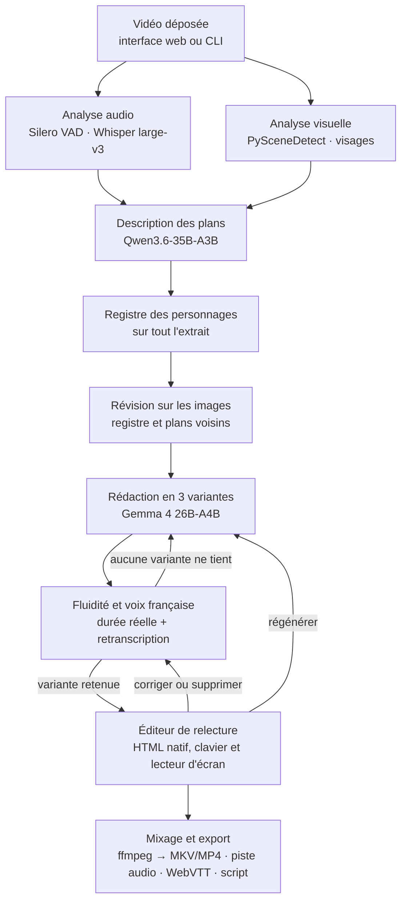

# Audesia — Brief projet

> Audiodescription automatique en français, 100 % locale, conçue pour l'ASUS Ascent GX10.
> Document de référence du dépôt : contexte du challenge, contraintes, architecture, backlog, puis dossier de candidature complet en annexe.
> Dernière mise à jour : 3 octobre 2026 (révision après revue technique : modèles, budget mémoire, méthode de preuve, périmètre, corpus, corrections du dossier).
> Nom du projet : **Audesia** (anciennement « Regard Sonore », renommé le 3 octobre 2026).

---

## 0. Contexte et échéances

Le projet est développé pour le **« ASUS Ascent GX10 – Local AI Developer Challenge »** (ASUS × Defend Intelligence, agence LoopIn).

| Date | Étape |
| --- | --- |
| 4 octobre 2026, 23h59 | Fin des candidatures (formulaire Gleam : 17 champs, dont une **vidéo de 2 min obligatoire**) |
| Juste après | Sélection de 8 projets, contactés par e-mail |
| Phase de test | Accès **à distance** à un GX10 pour développer, tester ou valider un élément du projet |
| Avant le 12 octobre 2026 | Remise des éléments de preuve (résultats, mesures, démo) |
| 12 octobre 2026 | Désignation du gagnant (lot : 1 GX10). Réponse à l'e-mail sous 72 h |

Source : règlement du challenge (Conditions Générales Gleam / ASUS). Ces modalités ne sont publiées nulle part ailleurs : en garder une copie. La durée de l'accès au GX10 n'est pas connue.

**Critères de présélection :** pertinence et innovation, qualité et faisabilité de l'approche, pertinence du GX10, potentiel de démonstration.

**Grille finale :**

| Critère | Poids |
| --- | --- |
| Pertinence et innovation | 30 % |
| Exécution et résultats démontrés | 30 % |
| Qualité technique et éléments de preuve | 20 % |
| Pertinence et validation de l'utilisation du GX10 | 20 % |

**Conséquence pour le code :** 70 % de la note porte sur la preuve. Tout doit être prêt et testé **avant** l'accès au GX10. L'accès distant ne sert qu'à lancer les calculs lourds et à collecter les mesures. Chaque exécution doit produire des métriques et des journaux exploitables dans le rapport. Le plan doit tenir si l'accès ne dure qu'une journée : tout ce qui ne dépend pas du GX10 (VAD, transcription, plans, images clés) est précalculé sur la 5080.

---

## 1. Contraintes non négociables

1. **100 % local.** Aucun appel réseau sortant à l'exécution (pas d'API cloud, pas de télémétrie). Les poids sont téléchargés une fois, puis tout tourne hors ligne.
   - pyannote 4 et vLLM envoient de la télémétrie par défaut. Toujours définir `PYANNOTE_METRICS_ENABLED=0 VLLM_NO_USAGE_STATS=1 DO_NOT_TRACK=1 HF_HUB_OFFLINE=1 HF_HUB_DISABLE_TELEMETRY=1`.
   - Preuve : la chaîne complète tourne dans un réseau Docker `internal: true` (aucune sortie possible), et chaque run note dans `metrics.json` qu'aucune connexion sortante n'aboutit (`outbound_network`).
   - Ce réseau a déjà révélé un appel caché : transformers 4.57 interroge l'API du Hub (`model_info`) à chaque chargement du tokenizer de qwen-tts. La réponse est désormais donnée localement, sans changer la tokenisation.
2. **Deux profils matériels, même code :**
   - `small` : développement sur RTX 5080 (16 Go VRAM, x86_64, WSL2). Sert aussi de **baseline de comparaison** pour le dossier.
   - `large` : ASUS Ascent GX10 (GB10, 128 Go de mémoire unifiée, **ARM64 / aarch64**). Tous les modèles restent chargés en même temps.
   - Les deux profils partagent la même partie audio (VAD, transcription, voix) et les mêmes entrées précalculées. Seuls le modèle de vision, le rédacteur et le contexte changent.
3. **ARM64 dès le départ** (vérifié le 3 octobre 2026) :
   - Serveurs de modèles : image officielle `vllm/vllm-openai:v0.30.0` (arm64, CUDA 13.0), épinglée par digest, avec la v0.29.0 en repli. Les images NGC vLLM à partir de 26.04 ne démarrent pas sur le pilote R580 du GX10 ; NGC 26.02 en secours.
   - Pipeline : image construite sur l'image vLLM (`docker/Dockerfile`), qui apporte CUDA 13 et PyTorch pour arm64 comme pour amd64. Elle est construite sur place sur le GX10 (`scripts/docker.sh build`), où ses couches sont déjà présentes pour les serveurs. Pas de test sous QEMU : l'émulation n'a pas de GPU.
   - Vérifier les roues aarch64 avant l'accès : `pip download -r requirements.txt --only-binary=:all: --platform manylinux_2_28_aarch64 --python-version 3.12`. Fait le 4 octobre : les 23 paquets ajoutés à l'image vLLM ont une roue aarch64, sauf `sox`, du Python pur distribué en source.
   - Éviter toute dépendance sans roue aarch64. CTranslate2 (faster-whisper, WhisperX) n'a pas de roue CUDA pour aarch64 : sur le GX10, il tourne sur le CPU sans prévenir.
4. **Tout mesurer.** Mémoire unifiée par étape, durée par étape, nombre de requêtes, tailles de batch. Logs JSON horodatés. Sur GB10, `nvidia-smi` affiche « Memory-Usage: Not Supported » et `docker stats` ne voit pas la mémoire CUDA : relever `/proc/meminfo`, `nvidia-smi --query-compute-apps` et les métriques vLLM (voir `scripts/bench_memory.sh`).
5. **Licences libres en priorité** (Apache 2.0, MIT, BSD). Signaler tout modèle non commercial (modèles InsightFace, XTTS-v2, poids F5-TTS, aligneur français par défaut de WhisperX, poids Hybrid Demucs entraînés sur MUSDB18-HQ, réservé à la recherche) et créditer les contenus CC-BY (films Blender, doublages Touhoppai, modèle pyannote community-1).
6. **Jamais de description qui couvre un dialogue en mode standard.** Invariant testé automatiquement : 100 % contre la parole détectée (vrai par construction, test unitaire). La qualité de la détection se mesure à part, contre une vérité terrain (objectif > 95 %).
7. **Honnêteté technique :**
   - La bande passante du GX10 (~273 Go/s) est inférieure à celle de la 5080 (~960 Go/s). L'argument du projet est la **capacité mémoire**, pas la vitesse. Privilégier modèles MoE et traitement en lot (vLLM batching).
   - Raisonner en GiB : CUDA voit environ 119,7 GiB sur les 128 Go annoncés, et le plafond réaliste pour vLLM est d'environ 105 GiB.
   - Toute affirmation sur la qualité 16 Go vs 128 Go reste une hypothèse tant qu'elle n'est pas mesurée.

---

## 2. Environnement de développement

- Machine de dev : Windows + **WSL2 (bash)**, GPU **RTX 5080 16 Go**. Homebrew (linuxbrew) disponible.
- Docker avec support GPU sous WSL2 (NVIDIA Container Toolkit). Sur la 5080 (sm_120) : torch compilé pour CUDA 12.8 ou plus ; CTranslate2 en float16 (INT8 désactivé sur sm_120).
- Cible : GX10 accessible à distance (modalités communiquées par l'organisateur après sélection). Déploiement par `scripts/docker.sh` (fetch, build, start, run) plutôt que par compose : compose ne sait pas vider le cache de pages entre les démarrages des deux serveurs, que le risque de gel impose.
- Python 3.12. Pas de Node : la page de relecture est en HTML natif.
- **À demander aux organisateurs dès la sélection :** sortie de `nvidia-smi`, `/etc/dgx-release` et `df -h` ; accès sudo (nécessaire pour vider le cache de pages) ; accès internet pour télécharger les modèles ; durée de l'accès.

---

## 3. Structure de dépôt proposée

```
audesia/
├── AUDESIA.md                 # ce fichier
├── README.md                  # pitch, schéma, démarrage rapide, résultats, crédits CC-BY
├── LICENSE                    # Apache-2.0
├── configs/
│   ├── small.toml             # RTX 5080 (16 Go), Ollama
│   ├── large.toml             # GX10 (128 Go), deux serveurs vLLM
│   └── test-vllm.toml         # chemin vLLM testé sur la RTX 5080
├── prompts/
│   ├── describe.fr.md         # consigne VLM (description d'un plan)
│   ├── write.fr.md            # consigne rédacteur (Charte AD, 3 variantes, budget)
│   └── verify.fr.md           # consigne vérification : chaque fait est-il visible ?
├── backend/audesia/
│   ├── cli.py                 # audesia run <vidéo> --profile small|large
│   ├── api/                   # FastAPI minimal : routes JSON + page de relecture (HTML natif)
│   ├── pipeline/
│   │   ├── audio.py           # ffmpeg + Silero VAD + ASR → parole, dialogues, silences
│   │   ├── shots.py           # PySceneDetect → plans + images clés
│   │   ├── faces.py           # YuNet + SFace (prises de vues réelles) → personnages
│   │   ├── describe.py        # VLM → description brute par plan
│   │   ├── verify.py          # second modèle → faits validés sur les images
│   │   ├── write.py           # rédacteur → 3 variantes par silence
│   │   ├── tts.py             # voix FR + durée réelle + retranscription de contrôle
│   │   ├── fit_loop.py        # choix de la variante, nouvel essai, accélération, abandon
│   │   ├── mix.py             # ffmpeg : atténuation, pistes, exports
│   │   └── orchestrator.py    # enchaînement, reprise (étape sautée si sa sortie existe), jobs parallèles
│   ├── llm.py                 # client OpenAI-compatible (vLLM, llama.cpp, Ollama)
│   └── metrics.py             # chronos, marqueurs d'étape, export JSON
├── eval/
│   ├── overlap.py             # chevauchement : parole détectée et vérité terrain
│   ├── run_corpus.py          # tout le corpus avec un profil : précalcul partagé, reprise, chevauchement mesuré
│   ├── report.py              # rapport Markdown, un tableau par profil (couverture dans metrics.json)
│   ├── judge.py               # à venir : juge VLM extérieur, comparaison par paires à l'aveugle
│   └── hallucination_sample.py# à venir : mêmes 100 silences pour les deux profils, vérification humaine
├── corpus/
│   ├── corpus.toml            # vidéos, sous-titres, pistes musique + effets, licences
│   └── download.py            # téléchargement dans corpus/media/, ignoré par git
├── scripts/
│   ├── bench_memory.sh        # relevé à 1 Hz sur l'hôte (/proc/meminfo, nvidia-smi --query-compute-apps) et garde-fou
│   └── docker.sh              # modèles, image du pipeline, serveurs vLLM et runs sur un réseau sans sortie
└── docker/
    ├── Dockerfile             # pipeline, sur l'image vLLM (arm64 et amd64)
    └── requirements.txt       # paquets ajoutés, aux versions validées sur la 5080
```

---

## 4. Pipeline



### Étapes, entrées et sorties

| # | Étape | Entrée | Sortie (fichier du job) |
| --- | --- | --- | --- |
| 1 | Extraction | vidéo | `audio.wav` (16 kHz mono pour la VAD et l'ASR + piste originale), images |
| 2 | Analyse audio | `audio.wav` | `segments.json` : parole (VAD + segments Whisper au débit plausible), dialogues (texte Whisper, locuteur si diarisation), silences utilisables |
| 3 | Plans | vidéo | `shots.json` : plans (début, fin), 3 à 8 images clés par plan. Seuls les plans qui recouvrent un silence utilisable (± une fenêtre) sont décrits |
| 4 | Personnages | images clés | `characters.json` : groupes de visages (prises de vues réelles) ou marquage visuel (animation) ; noms saisis dans l'éditeur |
| 5 | Description | plans + contexte | `raw_descriptions.json` : description factuelle par plan |
| 6 | Vérification (option, désactivée par défaut : §6) | description révisée + images clés | `facts` dans `descriptions.json` : faits élémentaires, validés ou rejetés sur les images |
| 6 bis | Registre et révision | une image par plan, puis les images de chaque plan + registre + plans voisins | `personnages.json` (désignation stable et traits de chaque personnage) ; descriptions révisées : même désignation pour une même personne, actions rattachées au bon personnage, rien de non visible |
| 7 | Rédaction | faits validés + silences | `descriptions.json` : 3 variantes par silence, budget en caractères |
| 8 | Voix + calage | variantes | `tts/*.wav`, durée réelle, retranscription ; variante retenue, sinon retour à 7 |
| 9 | Relecture (facultative) | `relecture.json` : horaire, place disponible, texte lu, statut et description de chaque fenêtre | `corrections.json` : textes relus (vide : fenêtre silencieuse), jamais écrasé par le pipeline ; seules les phrases changées sont resynthétisées, puis tout est remixé |
| 10 | Export | tout | `out.mkv` (piste « fra – audiodescription » marquée `visual_impaired`), `out.mp4` et `out_ad.mp4` (lecteur web), `ad.mp3`, `ad.vtt`, `script.txt` |

### Schémas JSON (indicatifs)

```json
// segments.json
{ "speech":    [{"start": 12.30, "end": 15.20, "source": "vad"}],
  "dialogues": [{"start": 12.40, "end": 15.10, "speaker": "S1", "text": "..."}],
  "silences":  [{"start": 15.20, "end": 19.80, "usable": true}] }

// descriptions.json
{ "items": [{
    "id": "d_0007", "silence": {"start": 15.20, "end": 19.80},
    "shots": ["s_0012"], "facts": ["f_0031", "f_0032"],
    "variants": ["Sintel escalade une paroi enneigée, le souffle court.",
                 "Sintel escalade une paroi enneigée.",
                 "Sintel grimpe."],
    "text": "Sintel escalade une paroi enneigée.", "budget_chars": 48,
    "tts_duration": 2.9, "speedup": 1.0, "asr_check_wer": 0.0, "fits": true,
    "version": 2, "review": "pending" }] }
```

### Règles de calage

- Parole = segments de la VAD (Silero, seuil 0,35, marge de 200 ms) : dans le doute, c'est de la parole.
- S'y ajoutent les segments Whisper au débit plausible (au plus 0,8 s par mot + 1 s, élargis de 0,5 s), qui rattrapent les chuchotements manqués par la VAD.
- Et les éclats vocaux (cris, souffles) : énergie 300–3400 Hz de la voix isolée par Hybrid Demucs (torchaudio), à plus de 8 dB au-dessus de la fuite de musique (`vocal.json`, précalculé). Une fenêtre décrite avant leur détection se réduit à sa plus grande place libre.
- Les autres segments Whisper sont écartés : sur Sintel, l'un étirait une phrase de 15 mots sur 53 s de musique et effaçait un silence de 51 s (mesuré le 4 octobre 2026).
- Silence utilisable : durée ≥ seuil configurable (par défaut 1,5 s), sans parole.
- Budget = (durée du silence − marges début/fin, par défaut 0,2 s chacune) × débit cible en **caractères par seconde**, à **calibrer sur la voix choisie** (plus fiable que le nombre de mots en français).
- Le rédacteur produit **3 variantes** (longue, moyenne, courte) en un seul appel. Les trois sont synthétisées en lot ; on garde la plus longue qui tient.
- Si aucune ne tient : nouvel appel avec la consigne de raccourcir (max N itérations), puis accélération légère de la voix (≤ 10 %, `atempo`), puis abandon de la description et signalement dans l'éditeur.
- Chaque clip est retranscrit par Whisper, après rééchantillonnage à 16 kHz. Il est refait, jusqu'à 3 essais, s'il est dit à plus de 16 caractères par seconde ou si un mot de plus de 3 lettres manque à la retranscription.
  - La comparaison est approximative (similarité ≥ 0,75), pour tolérer les finales muettes du français : « ouverte » et « ouvertes » se prononcent pareil.
  - Le nombre de synthèses refaites va dans `metrics.json`.
  - Testé sur les 10 phrases de la VF : aucun rejet à tort, environ 40 s de plus pour la voix.
- Mode étendu (pause vidéo, WCAG 1.2.7) : après le challenge.

### Règles de rédaction (pour `prompts/write.fr.md`)

Dérivées de la *Charte de l'audiodescription* (2008) et du *Guide de l'audiodescription* de l'Arcom (2020) :

- Présent de l'indicatif, troisième personne, phrases courtes, vocabulaire simple et précis. Jamais « on voit » ni « nous voyons ».
- Décrire uniquement ce qui est visible : qui, quoi, où, quand. Pas d'interprétation des intentions, pas d'anticipation.
- N'utiliser que les faits validés par l'étape de vérification.
- Ne pas répéter ce que les dialogues ou les sons disent déjà.
- Nommer un personnage seulement si son nom a été prononcé ou affiché (ne pas anticiper) ; sinon une désignation stable (« la jeune femme au manteau rouge »).
- Lire les textes importants à l'écran (titres, panneaux, génériques).
- Tenir compte de ce qui a déjà été décrit pour éviter les répétitions : après la première mention, « elle », « il » ou une forme courte ; la désignation complète revient après plus de 15 s sans description. Une redite de la description précédente est écartée (passe de fluidité, avant la voix).
- Terminer toute description commencée.
- Respecter strictement le budget fourni, en 3 variantes de longueurs différentes.
- Limite connue : la Charte demande aussi de ne jamais couvrir un son ou une musique signifiants. Pour l'instant, seule la parole est détectée.

---

## 5. Profils de configuration

Les profils sont des fichiers TOML dans `configs/`, choisis par `--profile`. Chacun donne un serveur, un modèle et un `extra_body` par rôle : `vlm` décrit les plans, établit le registre et lit les détails agrandis ; `writer` révise chaque description sur ses images, puis rédige. Ils fixent aussi le nombre d'images par fenêtre et les requêtes simultanées. La parole, la voix et le calage sont identiques d'un profil à l'autre.

| | `small` (RTX 5080) | `large` (GX10) | `test-vllm` (RTX 5080) |
| --- | --- | --- | --- |
| `vlm` | Gemma 4 26B-A4B QAT, Ollama | Qwen3.6-35B-A3B FP8, vLLM (port 8000) | Qwen3.5-2B, vLLM (port 8000) |
| `writer` | le même modèle | Gemma 4 26B-A4B NVFP4, vLLM (port 8001) | le même modèle |
| Réflexion coupée par | `reasoning_effort = "none"` | `chat_template_kwargs.enable_thinking = false` | idem |
| Images par fenêtre | 4 | 8, plus jusqu'à 8 copies éclaircies | 4 |
| Requêtes simultanées | 1 | 8 | 4 |

- Sur le GX10, le rédacteur est d'une autre famille que le modèle de vision : il relit sur les images ce que celui-ci a décrit.
- Les descriptions et les détails agrandis partent en parallèle. La révision et la rédaction restent en série, car chacune reprend la précédente.
- Les serveurs vLLM sont lancés par `scripts/docker.sh` dans l'image `vllm/vllm-openai:v0.30.0`, épinglée par digest, avec la v0.29.0 en repli. La v0.30.0 corrige des lenteurs sur GB10 : les prompts avec images de Gemma 4 étaient jusqu'à 3 à 4 fois plus lents, et le préremplissage de Qwen3.6 n'utilisait pas le bon noyau.
- Réglages de serveur imposés par des problèmes connus de vLLM :
  - Qwen3.6 : DeepGEMM dégrade sa précision sur Blackwell (#50332), d'où `--moe-backend triton` et `VLLM_USE_DEEP_GEMM=0`. Cache KV en BF16 : en FP8, il a déjà planté sur GB10 (#50331).
  - Gemma 4 NVFP4 : le dépôt livre un ancien modèle de conversation qui ne reconnaît pas les images envoyées en `image_url`. On lui donne celui de Google (`--chat-template`).
  - Qwen3.6 réfléchit par défaut, Gemma 4 non : `enable_thinking = false` est envoyé à chaque requête, et fixé aussi par défaut côté serveur.

**Balayage de modèles (GX10 uniquement, chargés un par un à la place du modèle principal) :**

| Rôle | Candidat | Poids |
| --- | --- | --- |
| Vision | Qwen3.5-122B-A10B NVFP4 (`nvidia/Qwen3.5-122B-A10B-NVFP4`) | ~78 GiB |
| Rédaction | gpt-oss-120b MXFP4 (`openai/gpt-oss-120b`) | ~61 GiB |
| Rédaction | Mistral Small 4 NVFP4 (`mistralai/Mistral-Small-4-119B-2603-NVFP4`) | ~66 GiB |
| Rédaction | Gemma 4 31B (`google/gemma-4-31B-it-qat-w4a16-ct`) | ~17 GiB (estimé) |

Juge de qualité : un VLM absent des chaînes comparées (par défaut Qwen3.5-122B-A10B, lancé après les runs).

Identifiants vérifiés sur Hugging Face le 3 octobre 2026, puis le 4 octobre pour les deux modèles du profil large : Qwen3.6-35B-A3B-FP8 (34,9 GiB, vision comprise) et Gemma-4-26B-A4B-NVFP4 (17,5 GiB, version instruct) ; versions plus récentes acceptées si elles tiennent dans le même budget mémoire. Gemma 4 12B est servi avec la vision par Ollama (`gemma4:12b-it-qat`) et par llama.cpp (`ggml-org/gemma-4-12B-it-GGUF`, fichier `mmproj` inclus). Mais sur Sintel, il inventait des personnages et des objets : le profil small utilise Gemma 4 26B-A4B (`gemma4:26b-a4b-it-qat`), qu'Ollama place en partie sur le CPU.

---

## 6. Backlog priorisé

### P0 — Avant l'envoi de la candidature (4 octobre, 23h59)

- [x] Candidature envoyée le 4 octobre 2026, avec la vidéo de présentation.
- [x] Dépôt `swinn37/AudesIA` créé avec README, licence et premiers résultats. Privé pour l'instant : à rendre public pour que le lien du formulaire s'ouvre.
- [x] Script CLI minimal, **en un seul fichier** (`audesia_p0.py`, lancé le 4 octobre sur la 5080, résultats au §7), sur un extrait de 1 à 2 min de Sintel ou Sprite Fright en version française, profil `small` :
  - Silero VAD → Whisper large-v3 (transformers, même code que sur le GX10) → PySceneDetect → VLM via un serveur compatible OpenAI (Ollama `gemma4:26b-a4b-it-qat`, llama.cpp ou vLLM) → réécriture en 3 variantes avec budget → Qwen3-TTS → mixage ffmpeg ;
  - coder contre l'API OpenAI : passer au GX10 ne doit demander qu'un changement de configuration.
- [x] Exporter l'extrait avec et sans audiodescription pour la vidéo de présentation (`clip.mp4`, `clip_ad.mp4`).
- [x] Relecture humaine facultative par fichier : `relecture.json` → `corrections.json` → même commande. Voix en cache par phrase : une correction ne resynthétise que ses phrases.
- [x] Maquette de la page de relecture (`relecture.html`, HTML natif), écrite dans chaque dossier de sortie avec les données du run. Elle fonctionne hors ligne : vidéo avec/sans AD, écoute de chaque phrase, correction et suppression avec durée estimée, enregistrement de `corrections.json`. Régénérer attend le serveur du P1.

### P1 — Après la sélection, avant l'accès au GX10

- [ ] Envoyer aux organisateurs les questions du §2 (pilote, sudo, internet, disque, durée).
- [ ] Pipeline modulaire (`pipeline/*`) : un fichier JSON par étape, reprise sur erreur (une étape est sautée si sa sortie existe).
- [ ] Parole = VAD seule, seuil et marge réglés contre la vérité terrain ; même ASR sur les deux profils pour le texte, sans compiler CTranslate2 (Whisper large-v3 via transformers, ou Qwen3-ASR-1.7B).
- [x] Détecter les sons vocaux brefs (cris, gémissements, souffles) que ni la VAD ni Whisper ne repèrent : énergie de la voix isolée par Hybrid Demucs (torchaudio, pas de nouvelle dépendance). Mesuré sur l'extrait VF de bout en bout :
  - 7 descriptions sur 9 sans chevauchement d'aucune voix, contre 5 sur 10 ;
  - chevauchement maximal 0,68 s au lieu de 1 s ; voix réelle couverte par la parole détectée : 90 % au lieu de 83 % ;
  - en contrepartie, couverture de 64 % au lieu de 76 % (un run). Le seuil (`BURST_DB`, +8 dB) a été choisi entre +6 et +10 dB sur les extraits VO et VF ;
  - séparation en 6 s pour 2 min de film, 86 s pour les 74 min du corpus.
- [ ] Rédaction en 3 variantes + `fit_loop.py` + tests unitaires de l'invariant « aucun chevauchement avec la parole détectée ».
- [x] Vérification visuelle fait par fait, en option (`verify` dans le profil) : le rédacteur découpe la description en faits élémentaires et juge chacun sur les images, en un appel par fenêtre ; seuls les faits visibles sont rédigés, et les faits écartés s'affichent dans la page de relecture.
  - Mesurée sur l'extrait VF (Gemma 26B se vérifiant lui-même) : 19 faits écartés sur 117, et 32 % de temps de description en plus.
  - À raison : la jeune fille, dans un plan où seul le dragon est visible.
  - À tort : la main gantée tendue vers le dragon, action clé du plan, rejetée en bloc à cause d'une couleur fausse (« beige »). Un « sol pavé » est resté, sur un toit.
  - Une consigne qui réécrit les faits en partie visibles au lieu de les écarter devient trop permissive.
  - Elle est donc désactivée par défaut, y compris sur le GX10, en attendant un A/B avec le juge.
- [ ] Comparatif de voix sur ~30 phrases d'audiodescription :
  - candidats : Qwen3-TTS-1.7B, Chatterbox V3 (commit épinglé), VoxCPM2 ;
  - critères : erreur de retranscription, écoute, vitesse ;
  - Chatterbox 0.1.7 est à éviter : torch 2.6 sans support RTX 50xx, plantage sur les textes ≤ 5 tokens.
- [ ] Personnages, au-delà du registre fait en P0 (désignations stables, attribution d'une main) : YuNet + SFace sur les prises de vues réelles, marquage visuel (un cercle de couleur par personnage) pour l'animation, personnages secondaires que le registre oublie, noms saisis dans l'éditeur.
- [ ] Une page web pour tout faire sans ligne de commande, à partir de la maquette `relecture.html` du P0, servie par FastAPI :
  - dépôt de la vidéo (voix, niveau de détail), puis avancement étape par étape ;
  - relecture : tableau accessible (horodatage, texte modifiable, place disponible en secondes et en caractères, statut, description factuelle, Écouter, Supprimer, Régénérer) ;
  - lecteur avec/sans AD qui bascule entre deux MP4, puis export ;
  - le serveur écrit le même `corrections.json` que la maquette et relance lui-même la voix et le mixage : un seul mécanisme, testé dès le P0 ; il ajoute Régénérer et l'écoute d'un texte modifié.
- [x] Profils `small`, `large` et `test-vllm` (`configs/*.toml`) : deux rôles, réflexion coupée, requêtes en parallèle, requêtes et jetons par modèle dans `metrics.json`. Serveurs vLLM lancés par `scripts/docker.sh` (image v0.30.0 épinglée par digest).
  - Chemin vLLM testé le 4 octobre sur la 5080 (image v0.30.0, Qwen3.5-2B) :
    - l'image démarre sur sm_120 et hors ligne ;
    - les images sont bien comptées (environ 465 jetons chacune), la réflexion est coupée et le JSON est lu ;
    - 4 requêtes simultanées prennent 0,8 s, contre 2,3 s en série, grâce aux lots de vLLM.
  - Le modèle de 2B est trop petit pour la tâche : il invente un nom et ignore les longueurs, si bien que le calage n'a placé aucune de ses descriptions. Le test valide le chemin, pas la qualité.
- [x] Image du pipeline (`docker/Dockerfile`) sur l'image vLLM, pour arm64 et amd64 : construite et testée sur la 5080 (amd64), roues aarch64 vérifiées. Sur le GX10, elle se construit sur place.
- [x] `scripts/bench_memory.sh` : relevé mémoire à 1 Hz sur l'hôte et garde-fou qui tue les serveurs vLLM sous 8 Gio disponibles.
- [ ] Marqueurs d'étape dans le relevé mémoire, pour attribuer la mémoire à chaque étape du pipeline.
- [x] Preuve hors ligne : serveurs et pipeline sur un réseau Docker interne, vérification de l'accès sortant dans `metrics.json`. Run complet testé sur la 5080 le 4 octobre : 2 min 37 s pour 25 s de vidéo, `outbound_network: false`.
- [x] `eval/run_corpus.py` (tout le corpus avec un profil, précalcul partagé, reprise après arrêt, chevauchement mesuré) et `eval/report.py` (un tableau par profil).
- [ ] Juge VLM extérieur (`eval/judge.py`) et échantillon de 100 silences pour la vérification humaine des hallucinations.
- [x] Corpus et vérité terrain (§7) téléchargés ; précalcul sur la 5080 de l'extrait, de la parole et des plans (`eval/run_corpus.py --precompute`, 51 min pour les 74 min du corpus). Les images clés sont extraites à la description, en quelques secondes.
  - Sur les films entiers, Whisper hallucine pendant la musique : « I'm sorry » en boucle sur 131 s de Sintel, « DECO DECO… » et du chinois sur la VF. Ces boucles passaient le filtre de débit et auraient effacé des silences. Elles sont écartées par le critère de Whisper lui-même (texte qui se compresse plus de 2,4 fois).
  - Elles ralentissent aussi la transcription : 22 min pour les 15 min de Sintel VO. À faire : ne transcrire que les segments de parole de la VAD, ou plafonner les jetons par tranche de 30 s.
- [ ] Run complet du corpus en profil `small` → résultats de référence archivés.

### P2 — Pendant l'accès au GX10

- [ ] Jour 1 (doit suffire à lui seul) :
  - `scripts/docker.sh fetch gx10`, `build` puis `start gx10` (cache de pages vidé, serveurs démarrés un par un, relevé mémoire et garde-fou) ;
  - run complet du corpus avec la configuration principale ;
  - mesures clés : chevauchement contre vérité terrain, couverture, temps, mémoire ;
  - A/B rapide du rédacteur sur 20 à 30 silences.
- [ ] Jour 2 : plusieurs vidéos en parallèle (débit).
- [ ] Jour 3 : balayage de modèles de classe 120B (§5), juge VLM extérieur, ablations (sans contexte, sans personnages, avec la vérification fait par fait).
- [ ] Jour 4 : rapport, vidéo de démo, publication.
- [ ] Plan B si mémoire insuffisante : versions NVFP4, contexte réduit, `--max-num-seqs` plus bas.

### P3 — Après le challenge

- [ ] Tests avec des utilisateurs aveugles/malvoyants (Fédération des Aveugles de France, association Valentin Haüy).
- [ ] Mode étendu (pause vidéo, WCAG 1.2.7).
- [ ] Nommage automatique des personnages ; détection des sons signifiants.
- [ ] File de jobs (Redis/RQ), base de données, frise visuelle avec forme d'onde : seulement si le besoin apparaît (multi-utilisateur, utilisateurs voyants).
- [ ] Extension PeerTube / lecteurs web, export LMS, export direct vers YouTube (pistes d'audiodescription).
- [ ] Mode questions-réponses à la demande sur la scène en cours.
- [ ] Autres langues, version installable clés en main.

---

## 7. Mesures et critères de réussite

| Mesure | Définition | Objectif |
| --- | --- | --- |
| Chevauchement (parole détectée) | % de descriptions dont [début, début + durée voix] n'intersecte aucune parole détectée | 100 % (invariant, test unitaire) |
| Chevauchement (vérité terrain) | Même mesure contre le masque de parole issu des pistes musique + effets et des sous-titres | > 95 % |
| Couverture | % des secondes de silence utilisable portant une description | À mesurer et comparer |
| Calage | % de descriptions abandonnées, itérations moyennes, accélération moyenne | À mesurer |
| Qualité | Grille 1-5 : exactitude, pertinence, cohérence des personnages, concision. Juge VLM absent des chaînes comparées, comparaison par paires à l'aveugle sur les mêmes silences, échantillon humain | Gain net du profil `large` |
| Hallucinations | Vérification humaine des mêmes 100 silences tirés au hasard, pour les deux profils | Taux mesuré et comparé |
| Voix | Taux d'erreur de retranscription des clips | À mesurer |
| Temps de traitement | minutes de calcul / minute de vidéo | À mesurer, cible < 5 |
| Mémoire maximale | Relevé à 1 Hz sur l'hôte, par étape (`/proc/meminfo`, `nvidia-smi --query-compute-apps`, métriques vLLM) | ≤ ~105 GiB, marge mesurée |
| Débit | vidéos traitées simultanément sans dégradation | ≥ 2 |
| Hors ligne | run complet dans un réseau Docker sans sortie | Réussi |

**Livrables pour l'organisateur :** rapport chiffré, journaux et relevés mémoire, extraits avant/après, comparaison GX10 vs 5080, courbe taille de modèle / qualité, log du run hors ligne, dépôt GitHub public.

**Premiers résultats** (4 octobre 2026, RTX 5080, Sintel 1:35–3:35, mesurés avec `eval/overlap.py`) :
- version originale : 13 descriptions sur 13 sans chevauchement des répliques, 10 sur 13 sans chevauchement d'aucune voix (éclats vocaux de moins de 0,7 s), couverture de 68 % ;
- doublage français (vérité terrain plus nette, musique atténuée de 15,8 dB) : 10 sur 10 sans chevauchement des répliques, chuchotements compris, 5 à 6 sur 10 sans chevauchement d'aucune voix selon les runs, couverture de 76 % ;
- 15 à 27 min de calcul pour 2 min de vidéo selon la charge du GPU (objectif : moins de 5 min par minute), parce que Gemma 4 26B déborde sur le CPU. Avec 8 images par plan, la suite des actions était mieux suivie, mais la description prenait 50 min : c'est un réglage pour le GX10.

Premier choix de modèle par la mesure, sur les 7 plans de la seconde partie vérifiés à l'image :
- Gemma 4 12B inventait un homme, un « livre taché de sang » (les ailes du dragon) et une hache ;
- Qwen3.6 35B-A3B décrivait juste 6 plans sur 7, mais inventait une personne ;
- Gemma 4 26B-A4B décrivait juste 6 plans sur 7 sans rien inventer.

Ce que la relecture des descriptions, plan par plan et image par image, a fait changer :
- le modèle de vision ne reçoit plus que les images : les répliques et les descriptions précédentes, en contexte, amorçaient des inventions ;
- un registre des personnages, puis une révision de chaque description sur ses images avec les plans voisins, gardent une même désignation et rattachent les actions au bon personnage : en VF, « la jeune fille aux cheveux roux » et « le petit dragon », et « elle tend une main gantée vers le dragon blessé » ;
- la consigne demande la suite des actions, des objets nommés précisément et les états visibles, sans aucun exemple concret : l'exemple « une pomme » avait fait écrire « une pomme rouge » à la place d'un fruit à piquants ;
- une passe de fluidité remplace la désignation déjà dite par « elle » ou une forme courte, et écarte les redites.

Deux techniques visent les objets mal reconnus :
- une copie éclaircie des images à contre-jour fait disparaître le « tissu noir » (le modèle y voit un morceau de bois) ;
- une question directe sur trois détails agrandis en pleine résolution reconnaît le fruit sur la bonne image.

Mais sur la 5080 la reconnaissance reste fragile. Sur trois images du même plan, le modèle répond « fruit épineux », « gant à pointes » ou « rien d'identifiable ». La posture est lue comme « se cache derrière » au lieu de « regarde dessous », et des « elle » restent ambigus quand deux personnages ont le même genre. Ces cas sont à remesurer sur le GX10, avec des modèles plus grands, une entrée haute résolution native et la vidéo.

En attendant, la relecture humaine facultative les corrige sans relancer les modèles de vision. Sur le doublage, quatre phrases corrigées (débris, fruit, couteau, main) ont été placées sans chevaucher de réplique, mesuré contre la piste musique + effets ; au critère strict, la version relue fait comme la version automatique (5 sur 10). La relance a pris environ 1 min 15 s, et 10 s sans changement, car seules les phrases nouvelles sont synthétisées.

Qwen3-TTS précipite parfois une phrase (19 à 20 caractères par seconde au lieu de 10 à 15) et avale un mot : « sur un toit » est retranscrit « sur un C ». Le P0 retranscrit désormais chaque clip et le refait, jusqu'à 3 essais, s'il est dit trop vite ou qu'un mot y manque (§4, règles de calage). Pour retranscrire un clip, rééchantillonner d'abord à 16 kHz : à 48 kHz, le pipeline Whisper rend du charabia.

Les chuchotements, d'abord manqués par la VAD, sont rattrapés par les segments Whisper au débit plausible. Les sons vocaux brefs (cris, gémissements, souffles) le sont par l'énergie de la voix isolée avec Demucs : sur l'extrait VF, 7 descriptions sur 9 ne touchent plus aucune voix, contre 5 sur 10, pour une couverture de 64 % au lieu de 76 %.

### Corpus et vérité terrain

Le corpus initial (Sintel, Tears of Steel, Spring) ne contenait qu'environ 3,5 min de dialogue, tout en anglais, et Spring n'en a aucun. Corpus retenu : 74 min, dont 64 % en français. Il est décrit dans `corpus/corpus.toml` et téléchargé par `corpus/download.py` (environ 3,3 Go) :

| Vidéo | Durée | Licence | Intérêt |
| --- | --- | --- | --- |
| [Sintel](https://durian.blender.org/) (VO anglaise) | 14:48 | CC BY 3.0 | Film de la démo ; piste musique + effets officielle : vérité terrain exacte |
| [Sintel, version française](https://peertube.touhoppai.moe/w/tZbHhmpfbC8vt2rw871P7A) (Touhoppai) | 17:03 | CC BY 3.0 et 4.0 | Le doublage est monté sur la même piste musique + effets (décalage de 28 ms) : vérité terrain exacte en français |
| [Tears of Steel](https://download.blender.org/demo/movies/ToS/) (VO anglaise) | 12:14 | CC BY 3.0 | Acteurs réels ; la piste musique + effets sans dialogues donne un masque de parole exact (fichiers son BY-ND : évaluation uniquement, pas de redistribution de dérivé) |
| [Sprite Fright, version française](https://peertube.touhoppai.moe/w/9HXS5EWh4TNKME8tyVFCne) (Touhoppai) | 10:30 | CC BY 4.0 | Dialogues de groupe en français, 6 personnages récurrents, VTT français |
| [Pepper&Carrot, épisode 6, VF](https://peertube.touhoppai.moe/w/rSSkd86E2C4ikCCwewZUsZ) | 7:37 | CC BY-SA 4.0 | Cas difficile : 51 % de parole, narrateur, visages 2D. La version audiodécrite sera aussi en BY-SA |
| [Le trésor de Sidiailles](https://film.k-prod.fr/w/6k27hDT7PbR2oZNoGrsPjc) (Kintésens) | 11:56 | CC BY (métadonnées PeerTube) | Prises de vues réelles en français. Licence à faire confirmer par écrit. Enfants à l'écran : ne publier aucun recadrage de visage |

- Secours : « HATTILA et le visiteur du passé » si la licence de Sidiailles n'est pas confirmée.
- Témoin sans dialogue : Spring.
- Référence de qualité : Elephants Dream, avec les audiodescriptions textuelles humaines de Silvia Pfeiffer (anglais, CC BY 4.0).
- À exclure : Agent 327 (CC BY-ND).
- Vérité terrain : masque de parole issu des pistes musique + effets pour Sintel (VO et VF) et Tears of Steel, soit 44 min sur 74. Les trois autres vidéos ont des sous-titres horodatés, trop lâches pour mesurer le chevauchement : ils restent affichés jusqu'à 2 s après la parole. Pour elles, la voix isolée par Demucs ou quelques minutes annotées à la main donneraient une vérité terrain.

---

# ANNEXE — Dossier de candidature complet

## A1. Résumé exécutif

Audesia génère automatiquement une piste d'audiodescription en français pour n'importe quelle vidéo, entièrement en local sur un ASUS Ascent GX10. L'outil repère les silences entre les dialogues, décrit ce qui se passe à l'écran avec un modèle de vision, vérifie chaque détail sur l'image, réécrit chaque description pour qu'elle tienne dans le silence disponible, puis la fait lire par une voix de synthèse mixée avec la bande-son.

- **Pour qui :** associations, médiathèques, organismes de formation, collectivités, créateurs vidéo et chaînes qui doivent rendre leurs vidéos accessibles sans budget d'audiodescription professionnelle.
- **Pourquoi en local :** les vidéos traitées (formations internes, archives, contenus non publiés) ne quittent jamais la machine, et le coût par heure de vidéo devient quasi nul.
- **Pourquoi le GX10 :** la chaîne complète (vision, rédaction, parole, voix) reste chargée en mémoire en permanence, avec de la place pour plusieurs vidéos en parallèle et pour comparer des modèles de classe 120B. Sur une carte grand public de 16 Go, il faut des modèles nettement plus petits, en partie chargés l'un après l'autre.
- **Ce qui sera validé sur le GX10 :** la mémoire réellement utilisée, la qualité des descriptions avec de grands modèles face à la version 16 Go, le respect des silences mesuré contre une vérité terrain (objectif : plus de 95 % des descriptions sans chevauchement de dialogue), la part des silences couverte et le temps de traitement par minute de vidéo.
- **Où en est le projet :** un prototype complet tourne sur RTX 5080. Sur un extrait de Sintel, en version originale comme en doublage français, aucune de ses descriptions ne chevauche une réplique, même chuchotée, mesuré contre la piste musique + effets officielle du film.
- **Livrable :** un dépôt open source, une démo web et des vidéos libres audiodécrites automatiquement.

## A2. Problème et contexte

L'audiodescription reste l'exception. Selon la Fédération des Aveugles de France, seulement 4 % des émissions de télévision sont audiodécrites ([communiqué de juillet 2019](https://aveuglesdefrance.org/app/uploads/2021/03/CP_Aveugles-de-France-au-festival-off-avignon-11-juillet-2019.pdf), sans source ni méthode ; chiffre repris dans une [question écrite à l'Assemblée nationale en 2024](https://questions.assemblee-nationale.fr/dyn/16/questions/QANR5L16QE14921)). En ligne, elle reste rare : YouTube n'a ouvert le dépôt de pistes d'audiodescription à toutes les chaînes éligibles qu'en septembre 2026.

- **Le public concerné est large.** Environ 1,7 million de personnes ont une déficience visuelle en France métropolitaine, dont 207 000 aveugles ou malvoyants profonds et 932 000 malvoyants moyens, soit 1,1 million avec une incapacité visuelle sévère (DREES, 2005, d'après l'enquête HID de 1998-2000). Les 560 000 autres, « malvoyants légers », ne seraient souvent pas comptés comme déficients visuels selon les critères médicaux (DREES). Ces données ont plus de 25 ans et la population a vieilli depuis.
- **La production humaine ne passe pas à l'échelle.** Une audiodescription professionnelle demande un auteur spécialisé, un comédien, un studio et un mixage. C'est justifié pour un film de cinéma, pas pour une vidéo de formation, un cours en ligne ou la chaîne YouTube d'une association.
- **Le cadre réglementaire se durcit.**
  - Les WCAG (critère 1.2.5, niveau AA) et le RGAA (critère 4.5) demandent une audiodescription synchronisée pour les vidéos préenregistrées, si nécessaire.
  - Depuis juin 2025, l'European Accessibility Act oblige les services donnant accès à des contenus audiovisuels à transmettre l'audiodescription quand elle existe. L'obligation d'en produire relève de la directive SMA et de l'Arcom.
- **Les solutions IA existantes passent par le cloud.** Certaines gèrent déjà le français, mais toutes obligent à envoyer ses vidéos chez un prestataire, souvent américain, ce qui bloque les contenus internes, non publiés, sensibles ou soumis au RGPD.

## A3. Solution et cas d'usage

On dépose une vidéo dans l'interface web ; quelques minutes plus tard, on récupère une piste d'audiodescription française synchronisée, relue et corrigeable avant export.

1. Repérage des dialogues et des silences utilisables.
2. Découpage en plans et reconnaissance des personnages d'un plan à l'autre.
3. Description de chaque plan avec un grand modèle de vision, en tenant compte de ce qui a déjà été décrit, puis vérification de chaque fait sur l'image par un second modèle.
4. Réécriture selon les règles de l'audiodescription et calage dans le silence disponible, en mesurant la durée réelle de la voix.
5. Génération de la voix, mixage avec la bande-son, export.
6. Relecture, correction ou régénération par un humain avant export.

**Formats de sortie :** MKV/MP4 avec piste audio « audiodescription » séparée et marquée pour les personnes malvoyantes, piste audio seule (téléversable comme piste d'audiodescription sur YouTube), WebVTT de descriptions, script texte.

| Utilisateur | Contenu | Ce que ça change |
| --- | --- | --- |
| Association, médiathèque | Vidéos de présentation, films libres, archives | Accessibilité sans budget de studio |
| Université, organisme de formation | Cours filmés, MOOC, tutoriels | Mise en conformité RGAA de catalogues entiers |
| Collectivité, service public | Vidéos institutionnelles, conseils municipaux | Conformité sans envoyer de données hors de l'organisation |
| Entreprise | Formations internes, onboarding, vidéos de sécurité | Contenus confidentiels traités sur site |
| Créateur vidéo | YouTube, vidéos courtes | Nouvelle audience, en quelques minutes |

**Mode standard :** les descriptions tiennent dans les silences. Un mode étendu, où la vidéo se met en pause quand une description indispensable ne trouve pas de place (WCAG 1.2.7, niveau AAA), est prévu après le challenge.

## A4. Back-end et front-end

| Brique | Choix | Rôle |
| --- | --- | --- |
| API | Python 3.12, FastAPI minimal | Dépôt, suivi des jobs, édition, export |
| Progression | Sondage de `GET /jobs/{id}` | Avancement étape par étape |
| Jobs | Pool de jobs dans le processus ; reprise par les fichiers JSON de chaque étape | Plusieurs vidéos en parallèle, reprise après erreur |
| Inférence | vLLM (GX10), llama.cpp (5080), API compatible OpenAI | Sert le modèle de vision et le rédacteur, avec batching sur le GX10 |
| Workers audio | Silero VAD, Whisper large-v3, voix française | Parole, silences, voix |
| Médias | ffmpeg | Extraction, découpe, mixage avec atténuation, encodage, multiplexage |
| Données | Un dossier par job, un fichier JSON par étape | Jobs, segments, descriptions et versions |
| Supervision | Logs JSON + relevé mémoire à 1 Hz sur l'hôte | Mémoire et charge par étape |
| Déploiement | `scripts/docker.sh`, image vLLM officielle arm64 (CUDA 13.0) pour les serveurs et, augmentée, pour le pipeline | Installation en quatre commandes sur un GX10 |

Pas de Redis, de WebSocket ni de base de données pour le challenge : ils n'apportent rien à la preuve. À ajouter seulement si l'outil devient multi-utilisateur.

**Modèle de données :**
- Un *Job* est un dossier (vidéo, paramètres, état) avec un fichier JSON par étape.
- Les *Segments* (parole, silence, plan) sont dans `segments.json` et `shots.json`.
- Chaque silence utilisable porte une *Description* : variantes des modèles dans `descriptions.json`, texte relu dans `corrections.json` (jamais écrasé par le pipeline), texte retenu, place disponible et statut dans `relecture.json`.

| Méthode | Route | Usage |
| --- | --- | --- |
| POST | `/jobs` | Déposer une vidéo, choisir la voix et le niveau de détail |
| GET | `/jobs/{id}` | État et progression (sondage) |
| GET | `/jobs/{id}/descriptions` | Descriptions et horodatages |
| PATCH | `/descriptions/{id}` | Corriger ou supprimer un texte (écrit `corrections.json`) |
| POST | `/descriptions/{id}/regenerate` | Régénérer une description |
| GET | `/jobs/{id}/export?format=mkv\|mp4\|mp3\|vtt\|txt` | Télécharger le résultat |

**Front-end :** une page HTML native servie par l'API, sans framework.
- **Dépôt :** voix, niveau de détail.
- **Relecture :** tableau accessible avec horodatage, texte modifiable, durée voix / durée silence écrite en clair, boutons Écouter, Supprimer et Régénérer, raccourcis clavier. Elle écrit `corrections.json`, comme la relecture par fichier. Sa maquette, `relecture.html`, tourne déjà hors ligne sur les sorties du P0.
- **Démonstration :** lecteur avec/sans AD qui bascule entre deux fichiers MP4 en conservant la position, car les navigateurs ne savent pas changer de piste audio.

L'interface est utilisable au clavier et au lecteur d'écran, pour que des créateurs aveugles puissent valider leurs descriptions. Une frise visuelle (forme d'onde) pourra s'ajouter plus tard pour les utilisateurs voyants.

## A5. Modèles et technologies

| Rôle | Modèle retenu | Licence | Alternative |
| --- | --- | --- | --- |
| Compréhension visuelle | Qwen3.6-35B-A3B (MoE, FP8) | Apache 2.0 | Qwen3.5-122B-A10B (NVFP4, balayage GX10) |
| Rédaction et vérification visuelle | Gemma 4 26B-A4B (MoE, NVFP4) | Apache 2.0 | gpt-oss-120b, Mistral Small 4, Gemma 4 31B (balayage GX10) |
| Vision + rédaction, profil 16 Go | Gemma 4 26B-A4B (QAT 4 bits, en partie sur le CPU) | Apache 2.0 | Gemma 4 12B (plus rapide, mais invente des détails) |
| Détection de parole | Silero VAD (paquet `silero-vad`) | MIT | pyannote segmentation |
| Cris et souffles | Voix isolée par Hybrid Demucs (`torchaudio`, HDEMUCS_HIGH_MUSDB_PLUS) | Code MIT ; poids entraînés sur MUSDB18-HQ (recherche) | Démixage par la piste musique + effets quand elle existe |
| Transcription | Whisper large-v3 (transformers ; faster-whisper sur x86) | MIT | Qwen3-ASR-1.7B (Apache 2.0) |
| Diarisation (optionnelle) | pyannote community-1 | CC-BY-4.0 (attribution ; télémétrie à couper) | — |
| Découpage en plans | PySceneDetect | BSD-3 | TransNetV2 (MIT) |
| Personnages | YuNet + SFace (prises de vues réelles) ; marquage visuel par le VLM (animation) | MIT / Apache 2.0 | InsightFace (modèles non commerciaux, exclu) |
| Voix française | Choix par comparatif : Qwen3-TTS-1.7B, Chatterbox V3, VoxCPM2 | Apache 2.0 / MIT / Apache 2.0 | Kyutai TTS (CC-BY-4.0) ; exclus : XTTS-v2, F5-TTS (non commerciaux) |
| Service des modèles | vLLM, llama.cpp, PyTorch | Apache 2.0 / MIT / BSD | TensorRT-LLM |
| Médias | ffmpeg | LGPL / GPL | — |

**Vérifié le 3 octobre 2026 :**
- Les images NGC vLLM à partir de 26.04 sont incompatibles avec le pilote R580 : utiliser `vllm/vllm-openai:v0.30.0` (CUDA 13.0), ou la v0.29.0 en repli.
- CTranslate2 n'a pas de version GPU pour aarch64.
- Chatterbox 0.1.7 épingle torch 2.6 (sans support RTX 50xx) et plante sur les textes ≤ 5 tokens.
- pyannote 4 et vLLM envoient de la télémétrie par défaut.
- L'aligneur français par défaut de WhisperX est non commercial.

**Reste à vérifier sur la machine :** version du pilote, accès sudo et internet, espace disque.

## A6. Pourquoi en local, et pourquoi le GX10

Le GX10 garde toute la chaîne en mémoire en permanence, avec de la place pour plusieurs vidéos en parallèle et pour comparer des modèles de classe 120B. C'est une des rares machines de bureau à réunir 128 Go de mémoire unifiée et toute la pile CUDA (vLLM, FP4 Blackwell). Son avantage est la capacité mémoire, pas la vitesse brute.

- **Confidentialité :** formations internes, archives familiales, vidéos avec des mineurs ou des patients ne quittent jamais la machine.
- **Coût :** pas de facturation à la minute ; audiodécrire un catalogue entier ne coûte que l'électricité.
- **Souveraineté :** pas de dépendance à une API qui change de prix ou disparaît.

| Composant chargé en permanence | Mémoire estimée |
| --- | --- |
| Vision : Qwen3.6-35B-A3B FP8 | ~35 GiB |
| Rédaction + vérification : Gemma 4 26B-A4B NVFP4 | ~17,5 GiB |
| VAD, transcription, voix, visages, découpage | ~8 GiB |
| Caches KV et runtimes vLLM (2 serveurs, 2 à 3 vidéos en parallèle) | ~15 GiB |
| **Total estimé** | **~76 GiB sur ~119,7 GiB visibles (plafond réaliste ~105 GiB)** |

Ces chiffres sont des estimations à confirmer par la mesure.
- La marge restante sert à traiter plusieurs vidéos en parallèle.
- Le balayage charge à la place des modèles de classe 120B : Qwen3.5-122B-A10B (NVFP4, ~78 GiB) en vision, gpt-oss-120b (~61 GiB) ou Mistral Small 4 (NVFP4, ~66 GiB) en rédaction.
- Le projet choisit ainsi ses modèles par la mesure, pas selon ce qui rentre en mémoire.

| | RTX 5080 (16 Go) | ASUS Ascent GX10 (128 Go) |
| --- | --- | --- |
| Modèle de vision | Gemma 4 26B-A4B, 4 bits, en partie sur le CPU | Qwen3.6-35B-A3B FP8, jusqu'à 122B en balayage |
| Rédacteur | Le même modèle | Gemma 4 26B-A4B dédié, jusqu'à 120B en balayage |
| Chargement | ASR déchargé avant la description | Tout reste en mémoire |
| Contexte vidéo | 4 images par plan, 2 plans de contexte | 8 images par plan, 6 plans de contexte |
| Vidéos en parallèle | Une seule | 2 à 3 (batching vLLM) |

**Point d'honnêteté :**
- La bande passante du GX10 est d'environ 273 Go/s, contre environ 960 Go/s pour la 5080. Sur un petit modèle seul, la 5080 est plus rapide. Le projet exploite donc des modèles MoE et du traitement en lot plutôt qu'une conversation temps réel.
- Avec assez de RAM système, llama.cpp peut aussi faire tourner de gros modèles MoE sur la 5080 en déportant une partie des experts sur le CPU, mais lentement et un seul à la fois.
- La différence de qualité entre 16 Go et 128 Go est une hypothèse que le test doit mesurer.

## A7. Concurrence

Le lancement de Google ne vise pas le même problème : **Guided Vision** décrit en direct ce que filme la caméra du téléphone, il ne produit pas de piste d'audiodescription pour une vidéo. Les concurrents directs sont des services cloud, dont certains gèrent déjà le français.

**Google Guided Vision (Gemini Live), lancé le 1er octobre 2026** ([annonce Google](https://blog.google/innovation-and-ai/products/gemini-app/guided-vision-gemini-live/)) :
- L'utilisateur partage la caméra de son téléphone Android ; Gemini décrit l'environnement à voix haute, répond aux questions et guide le cadrage. Le modèle a été développé avec Aira, entraîné sur des dizaines de milliers d'heures d'interprétation visuelle, et testé par plus de 1 000 membres du réseau de testeurs d'Aira.
- Usages : lire une étiquette ou un cadran, retrouver un objet, décrire une pièce ou une tenue. Google précise que ce n'est ni une aide à la navigation ni un détecteur d'obstacles.
- Pour Audesia : complémentaire, pas concurrent (monde réel en direct via le cloud vs vidéos enregistrées, piste synchronisée, relue, exportable, en local).
- Risque : une audiodescription automatique intégrée à YouTube, qui resterait limitée aux vidéos YouTube et au cloud. À ce jour, YouTube accepte les pistes d'audiodescription téléversées (depuis le 4 septembre 2026) mais n'en génère pas : c'est un débouché pour Audesia.

| Acteur | Type | Ce qu'il fait | Limite face à Audesia |
| --- | --- | --- | --- |
| [ViddyScribe](https://viddyscribe.com/) | SaaS cloud | AD IA standard et étendue, 98 langues dont le français, exports VTT/SRT/audio/vidéo, intégrations YouTube, Vimeo, Panopto, Kaltura, Brightcove, API | Cloud, abonnement |
| [Verbit](https://verbit.ai/ai-audio-description/) | SaaS cloud + humains | AD IA synchronisée, WCAG 1.2.5, relecture humaine en option, livraison en 24 à 48 h | Cloud |
| [3Play Media](https://www.freelock.com/advent/2025/12-whats-happening-on-screen-audio-description-videos) | Service | AD par IA (script et voix) ou rédigée par des humains, AD étendue, français disponible | Cloud, prestation payante |
| Audible Sight | SaaS cloud | AD IA, plus de 100 voix de synthèse, paiement à l'usage | Cloud |
| [YouDescribe](https://www.freelock.com/advent/2025/12-whats-happening-on-screen-audio-description-videos) | Communautaire | Descriptions pour YouTube ; depuis 2025, brouillons IA relus par des bénévoles, placés automatiquement et lus par une voix de synthèse | Limité à YouTube |
| [ViDscribe](https://arxiv.org/abs/2603.14662) | Recherche (CHI 2026, Extended Abstracts) | AD par LLM multimodal pour YouTube, personnalisable, questions-réponses ; étude avec 8 participants aveugles ou malvoyants | Prototype, cloud |
| [ADCanvas](https://research.google/pubs/adcanvas-accessible-and-conversational-audio-description-authoring-for-blind-and-low-vision-creators/) | Recherche CMU / Google (CHI 2026) | Outil de rédaction d'AD pour créateurs aveugles, assisté par IA ; étude avec 12 créateurs | Prototype |
| Studios d'audiodescription | Prestation humaine | Qualité de référence cinéma/TV | Coût et délais incompatibles avec le volume |

Aucune offre française d'audiodescription par IA en local ou sur site n'a été identifiée (Authôt fait de la transcription et du sous-titrage, Voxygen de la synthèse vocale). Les outils cloud gèrent déjà le français : la différence d'Audesia tient au local, au respect des normes françaises d'audiodescription, à la relecture accessible et à l'open source.

**Recherche :**
- La chaîne « modèle de vision → modèle de langage » est établie dans la littérature :
  - [AutoAD-II](https://arxiv.org/abs/2310.06838) place les descriptions dans les pauses et utilise une banque de personnages ;
  - [AutoAD-Zero](https://arxiv.org/abs/2407.15850) marque chaque personnage d'un cercle de couleur sur l'image avant de le décrire ;
  - [Shot-by-Shot](https://arxiv.org/abs/2504.01020) tient compte de la grammaire du film.
- En 2026, [« What, When, and How »](https://arxiv.org/abs/2609.30121) montre que les LLM dépassent le débit visé dans 17 à 29 % des cas, ce qui justifie de mesurer la durée réelle de la voix.
- Aucun système ni corpus d'audiodescription en français n'a été trouvé ; [SwissADT](https://arxiv.org/abs/2411.14967) ne fait que traduire des scripts.

## A8. Différenciation

- **Local et souverain :** aucune vidéo ne sort de la machine, et un test sans réseau le prouve.
- **Pensé pour le français :** consignes de rédaction dérivées de la Charte de l'audiodescription (2008) et du Guide de l'audiodescription de l'Arcom (2020), voix française choisie par comparatif.
- **Cohérence narrative :** personnages suivis d'un plan à l'autre, mémoire de ce qui a déjà été décrit.
- **Vérification visuelle :** chaque fait est validé sur l'image par un second modèle, d'une autre famille.
- **Calage mesuré :** la durée réelle de la voix est mesurée plutôt qu'estimée, et aucune description ne chevauche la parole détectée.
- **L'humain garde la main :** éditeur accessible pour valider chaque phrase.
- **Open source et déployable sur site :** pas de coût à la minute.

## A9. Risques

| Risque | Parade |
| --- | --- |
| Le modèle de vision invente des éléments | Vérification visuelle fait par fait par un second modèle d'une autre famille, consigne « ne décrire que le visible », relecture humaine |
| Personnages confondus ou mal nommés | Visages regroupés sur toute la vidéo (prises de vues réelles), marquage visuel pour l'animation, noms seulement s'ils sont prononcés ou affichés, correction dans l'éditeur |
| Mémoire insuffisante | Configuration principale estimée à ~76 GiB ; versions NVFP4 ; contexte réduit |
| Gel de la machine au démarrage des serveurs (mémoire unifiée, vLLM #46307), sans redémarrage possible à distance | 0,40 + 0,25 de la mémoire réservés au plus ; serveurs démarrés l'un après l'autre, cache de pages vidé avant chacun ; garde-fou qui les tue sous 8 Gio disponibles |
| Incompatibilités ARM64 | Image vLLM officielle CUDA 13.0 (compatible pilote R580) pour les serveurs et le pipeline, roues aarch64 vérifiées le 4 octobre |
| Détection de parole imparfaite (musique, chants) | VAD sensible avec marge, réglée et mesurée contre une vérité terrain (pistes musique + effets) |
| Voix peu naturelle ou qui saute des mots | Comparatif de 3 moteurs, retranscription de contrôle de chaque clip |
| Licences incompatibles | Apache 2.0 / MIT en priorité ; aligneur non commercial de WhisperX évité ; attribution CC-BY (pyannote community-1, films Blender) |
| Télémétrie cachée | Variables d'environnement + run complet dans un réseau Docker sans sortie, qui a déjà révélé un appel caché de transformers au Hub, neutralisé |
| Phase de test très courte | Tout prêt avant l'accès, plan tenable en une journée, entrées précalculées |

## A10. Sources

- Règlement du challenge (Conditions Générales, Gleam / ASUS) — dates, critères, grille de notation. Non publié ailleurs : en garder une copie.
- [DREES, *Études et Résultats* n° 416 (juillet 2005)](https://drees.solidarites-sante.gouv.fr/publications/etudes-et-resultats/les-personnes-ayant-un-handicap-visuel-les-apports-de-lenquete), d'après l'enquête HID (1998 en institution, 1999-2000 à domicile) — 1,7 million de déficients visuels en France métropolitaine (29 pour 1 000), dont 207 000 aveugles ou malvoyants profonds (61 000 aveugles complets), 932 000 malvoyants moyens et 560 000 malvoyants légers.
- [Fédération des Aveugles de France, communiqué du 11 juillet 2019](https://aveuglesdefrance.org/app/uploads/2021/03/CP_Aveugles-de-France-au-festival-off-avignon-11-juillet-2019.pdf) — 4 % des émissions de télévision audiodécrites, 100 films sur 500 au cinéma ; aucune source citée.
- [Question écrite n° 14921, Assemblée nationale (6 février 2024)](https://questions.assemblee-nationale.fr/dyn/16/questions/QANR5L16QE14921) — reprend le chiffre de 4 %.
- [Groupe VYV — Manifeste déficience visuelle 2024](https://www.groupe-vyv.fr/wp-content/uploads/2024/12/Manifeste-DV-2024-PDF.pdf)
- [Charte de l'audiodescription (2008)](https://pedagogie.ac-orleans-tours.fr/documents/pdf/audiodescription_charte_mn37.pdf) · Arcom, *Guide de l'audiodescription* (décembre 2020)
- [WCAG 2.2 — critère 1.2.5](https://www.w3.org/WAI/WCAG22/Understanding/audio-description-prerecorded.html) · [RGAA 4.1 — critère 4.5](https://accessibilite.numerique.gouv.fr/methode/criteres-et-tests/) · Directive (UE) 2019/882 (European Accessibility Act)
- [Google — annonce Guided Vision (1er octobre 2026)](https://blog.google/innovation-and-ai/products/gemini-app/guided-vision-gemini-live/)
- [YouTube ouvre les pistes d'audiodescription à toutes les chaînes (4 septembre 2026)](https://caniplaythat.com/2026/09/04/youtube-makes-audio-descriptions-feature-available-to-all-channels/)
- [ViddyScribe](https://viddyscribe.com/) · [Verbit AI Audio Description](https://verbit.ai/ai-audio-description/)
- [Freelock — panorama des services d'audiodescription](https://www.freelock.com/advent/2025/12-whats-happening-on-screen-audio-description-videos)
- [ViDscribe (CHI 2026, Extended Abstracts)](https://arxiv.org/abs/2603.14662) · [ADCanvas (CHI 2026)](https://arxiv.org/abs/2602.07266)
- Recherche : [AutoAD-II](https://arxiv.org/abs/2310.06838) · [AutoAD-Zero](https://arxiv.org/abs/2407.15850) · [Shot-by-Shot](https://arxiv.org/abs/2504.01020) · [What, When, and How](https://arxiv.org/abs/2609.30121) · [VLM comme évaluateurs d'AD](https://arxiv.org/abs/2602.01390)
- [compar:IA — classement des modèles en français](https://arene.comparia.beta.gouv.fr/ranking)
- [NVIDIA — DGX Spark, problèmes connus (mémoire et nvidia-smi)](https://docs.nvidia.com/dgx/dgx-spark/known-issues.html)
