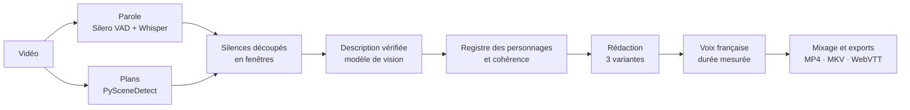

# Audesia

**Audiodescription automatique en français, 100 % locale.**

Audesia ajoute une piste d'audiodescription française à une vidéo. Il repère les silences entre les dialogues, décrit ce qui se passe à l'écran avec un modèle de vision, réécrit chaque description pour qu'elle tienne dans le silence, puis la fait lire par une voix de synthèse mixée à la bande-son. Une fois les modèles téléchargés, tout tourne hors ligne : aucune vidéo ne quitte la machine.

> Projet candidat au **ASUS Ascent GX10 – Local AI Developer Challenge**.
> État : prototype initial, un script de bout en bout ([`audesia_p0.py`](audesia_p0.py)), testé sur RTX 5080. Premiers résultats mesurés : voir [Résultats](#résultats).

## Pourquoi

- En France métropolitaine, environ 1,7 million de personnes ont une déficience visuelle, dont 1,1 million avec une incapacité visuelle sévère ([DREES, 2005](https://drees.solidarites-sante.gouv.fr/publications/etudes-et-resultats/les-personnes-ayant-un-handicap-visuel-les-apports-de-lenquete), d'après l'enquête HID de 1998-2000). Selon la [Fédération des Aveugles de France (2019)](https://aveuglesdefrance.org/app/uploads/2021/03/CP_Aveugles-de-France-au-festival-off-avignon-11-juillet-2019.pdf), seulement 4 % des émissions de télévision sont audiodécrites, et l'audiodescription reste rare en ligne.
- Une audiodescription professionnelle (auteur, comédien, studio) se justifie pour un film, pas pour un cours filmé, une formation interne ou la chaîne d'une association.
- Les outils d'IA existants sont des services cloud : ils sont exclus pour les vidéos internes, non publiées ou soumises au RGPD.

Audesia s'adresse aux médiathèques, universités, collectivités, entreprises et créateurs qui veulent audiodécrire leurs vidéos sur site, sans coût à la minute. L'audiodescription générée doit être relue avant diffusion : elle ne remplace pas le travail d'un audiodescripteur professionnel quand le budget le permet.

## Comment ça marche

1. **Parole** : Silero VAD repère la parole. Les segments de Whisper large-v3 au débit plausible s'y ajoutent, ce qui rattrape les répliques chuchotées. Le reste forme les silences utilisables. La transcription sert aussi de contexte au rédacteur.
2. **Plans** : PySceneDetect découpe la vidéo aux changements de plan.
3. **Fenêtres** : chaque silence long est découpé en fenêtres de 5 à 10 s, coupées aux changements de plan. Chaque fenêtre reçoit une description.
4. **Description et vérification** : un modèle de vision décrit les images de la fenêtre, sans autre contexte, puis confronte sa description aux images pour retirer ce qui n'y est pas.
5. **Registre et cohérence** : sur l'ensemble de l'extrait, le modèle établit un registre des personnages (une désignation stable et des traits visuels pour chacun), puis harmonise toutes les descriptions. Une même personne garde la même désignation, les contradictions sont corrigées, et rien n'est ajouté.
6. **Rédaction** : le même modèle réécrit chaque description en trois variantes de longueurs décroissantes, selon les règles de l'audiodescription.
7. **Voix** : chaque variante est synthétisée et mesurée ; la plus longue qui tient dans le silence est retenue.
8. **Mixage** : la bande-son est atténuée sous la voix, puis exportée.



Cinq principes :

- **Jamais sur un dialogue.** La détection de parole est réglée pour être sensible, avec une marge autour de chaque réplique : dans le doute, c'est de la parole. Une assertion fait échouer le traitement si une description chevauche une parole détectée.
- **Calage sur la durée réelle de la voix**, pas sur une estimation du débit. Si aucune variante ne tient, la plus courte peut être accélérée de 10 % au plus ; sinon la description est abandonnée et signalée.
- **Règles de l'audiodescription française.** Les consignes suivent la *Charte de l'audiodescription* (2008) : présent, troisième personne, uniquement ce qui est visible, pas d'interprétation, un personnage n'est nommé qu'une fois son nom prononcé ou affiché.
- **Ne rien inventer, garder les mêmes personnages.** Le modèle de vision ne voit que les images, une vérification retire ce qui n'y est pas, et un registre fixe la désignation de chaque personnage pour toute la vidéo.
- **Mesurer chaque exécution.** Durée par étape, couverture des silences, débit de la voix et mémoire sont enregistrés dans `metrics.json`.

## Démarrage rapide

Prérequis : Linux, WSL2 ou Windows, GPU NVIDIA (testé sur une RTX 5080 16 Go sous Windows), Python 3.12, ffmpeg. Environ 25 Go de modèles sont téléchargés au premier lancement.

Les commandes ci-dessous sont pour Linux. Sous Windows, installez ffmpeg (winget ou scoop) et l'application Ollama, avec un contexte d'au moins 8 192 jetons dans ses réglages, puis les mêmes paquets pip dans un environnement virtuel.

```bash
sudo apt install ffmpeg sox
pip install torch torchaudio --index-url https://download.pytorch.org/whl/cu128
pip install qwen-tts silero-vad scenedetect openai
curl -fsSL https://ollama.com/install.sh | sh
```

Le modèle de vision est servi par Ollama, avec un contexte élargi pour accepter 4 images par requête :

```bash
OLLAMA_CONTEXT_LENGTH=8192 ollama serve &
ollama pull gemma4:26b-a4b-it-qat
```

Audiodescription de la scène de la hutte dans *Sintel*, où un vieil homme recueille la jeune femme :

```bash
wget https://download.blender.org/durian/movies/Sintel.2010.1080p.mkv
python audesia_p0.py Sintel.2010.1080p.mkv --start 1:35 --end 3:35
```

Le [doublage français de Sintel par Touhoppai](https://peertube.touhoppai.moe/w/tZbHhmpfbC8vt2rw871P7A) (CC BY) fonctionne aussi ; ses horaires diffèrent de ceux de la version originale.

Pour vérifier la logique de calage sans GPU :

```bash
python audesia_p0.py --selftest
```

### Sorties

Les fichiers sont écrits dans `out/<vidéo>_<début>-<fin>/` :

| Fichier | Contenu |
| --- | --- |
| `clip.mp4`, `clip_ad.mp4` | L'extrait sans et avec audiodescription |
| `clip_ad.mkv` | Deux pistes audio : l'originale et l'audiodescription, marquée pour les personnes malvoyantes ; descriptions en sous-titres WebVTT |
| `ad.vtt`, `ad.json` | Descriptions retenues, horodatées |
| `segments.json`, `shots.json`, `descriptions.json` | Étapes intermédiaires, mises en cache |
| `metrics.json` | Durée par étape, couverture des silences, débit mesuré de la voix, pic mémoire |

Les étapes coûteuses sont mises en cache. Supprimer `descriptions.json` relance la rédaction ; changer de voix ou de débit ne refait que la voix et le mixage.

### Options utiles

| Option | Rôle |
| --- | --- |
| `--start`, `--end` | Bornes de l'extrait (`mm:ss`) |
| `--base-url`, `--model` | Serveur compatible OpenAI : Ollama (par défaut), llama.cpp ou vLLM |
| `--cps` | Débit de la voix en caractères par seconde ; reprendre `measured_chars_per_s` de `metrics.json` |
| `--voice` | Voix Qwen3-TTS : Vivian (par défaut), Serena, Ryan, Aiden… |
| `--tts-model` | `Qwen/Qwen3-TTS-12Hz-0.6B-CustomVoice` si la mémoire vidéo manque |

## Pourquoi le GX10

| | RTX 5080 (16 Go) | ASUS Ascent GX10 (128 Go unifiés) |
| --- | --- | --- |
| Vision | Gemma 4 26B-A4B, 4 bits, en partie sur le CPU | Qwen3.6-35B-A3B FP8, jusqu'à 122B en comparaison |
| Rédaction et vérification | Le même modèle | Gemma 4 26B-A4B dédié, jusqu'à 120B en comparaison |
| Modèles chargés | En partie l'un après l'autre | Tous en même temps, 2 à 3 vidéos en parallèle |

Le GX10 a moins de bande passante mémoire que la 5080 (environ 273 contre 960 Go/s). Son intérêt est la capacité : toute la chaîne reste chargée, plusieurs vidéos passent en parallèle, et des modèles de classe 120B peuvent être comparés pour choisir les modèles par la mesure. Pour limiter l'effet de la bande passante, Audesia s'appuie sur des modèles MoE et sur le traitement en lot (vLLM). Sur la 5080, un premier constat est déjà mesuré : le modèle de 12B invente des détails, et celui de 26B, qui décrit juste, déborde sur le CPU. Le gain apporté par des modèles plus grands encore reste à mesurer sur le GX10.

## Plan de test

Les deux profils traitent le même corpus avec les mêmes entrées audio et visuelles :

| Mesure | Méthode | Objectif |
| --- | --- | --- |
| Chevauchement des dialogues | Contre la parole détectée, puis contre une vérité terrain : pistes musique + effets sans dialogues de *Sintel* et *Tears of Steel*, sous-titres horodatés | 100 % par construction ; > 95 % contre la vérité terrain |
| Couverture | Part des silences utilisables qui reçoit une description | À mesurer |
| Qualité | Comparaison par paires à l'aveugle, juge VLM extérieur aux deux chaînes, échantillon humain | Gain net du GX10 |
| Hallucinations | Vérification humaine des mêmes 100 descriptions pour les deux profils | Taux comparé |
| Temps de traitement | Minutes de calcul par minute de vidéo | < 5 |
| Mémoire | Relevé à 1 Hz sur l'hôte, par étape | Marge mesurée |
| Hors ligne | Traitement complet dans un réseau Docker sans accès sortant | Réussi |

Corpus (environ 42 min, dont 71 % en français) : *Tears of Steel*, *Sprite Fright* et *Pepper&Carrot* (épisode 6) en version française, *Le trésor de Sidiailles*. Le détail est dans [AUDESIA.md](AUDESIA.md).

## Résultats

Mesures du prototype sur RTX 5080 (16 Go), le 4 octobre 2026 : *Sintel*, de 1:35 à 3:35, en version originale et dans le doublage français de Touhoppai. L'extrait contient 12 répliques séparées de silences courts, un long passage musical, puis des répliques chuchotées.

| Mesure | Version originale | Doublage français |
| --- | --- | --- |
| Descriptions placées | 13 sur 13 | 10 sur 10 |
| Sans chevauchement des répliques, chuchotements compris | **13 sur 13 (100 %)** | **10 sur 10 (100 %)** |
| Sans chevauchement d'aucune voix (répliques, cris, souffles) | 10 sur 13 (77 %), au plus 0,66 s | 6 sur 10 (60 %), au plus 1 s |
| Couverture des silences utilisables | 76 % | 69 % |
| Fiabilité de la vérité terrain (musique atténuée dans le résidu) | 6,9 dB | 15,8 dB |

- **Modèle de vision et de rédaction :** Gemma 4 26B-A4B (4 bits). Il ne tient pas en entier dans 16 Go : Ollama en place une partie sur le CPU.
- **Temps de calcul :** 12 à 13 min pour 2 min de vidéo, soit environ 6 min par minute (objectif : moins de 5), dont 9 à 10 min pour la description, la vérification, le registre et la cohérence. Ce dépassement vient de la partie du modèle placée sur le CPU.
- **Mémoire GPU :** pic de 10,5 Gio dans le processus Python pendant la transcription ; le modèle de vision est libéré avant la voix.

**Choix du modèle, mesuré sur les mêmes images.** Sur les 7 plans de la seconde partie, vérifiés un à un à l'image :

- Gemma 4 12B inventait un homme qui saisit Sintel, un « livre taché de sang » (les ailes du dragon) et une hache.
- Qwen3.6 35B-A3B décrivait juste 6 plans sur 7, mais inventait une personne sur le septième.
- Gemma 4 26B-A4B décrivait juste 6 plans sur 7 sans rien inventer, avec seulement une couleur de cheveux fausse et une ville omise.

Sur 16 Go, le modèle qui décrit juste ne tient donc déjà plus en mémoire.

**Vérité terrain.** La piste musique + effets officielle de *Sintel* est soustraite du mixage, après calage par corrélation (à 5 ms près) et ajustement du gain. La parole est détectée dans ce résidu par Silero VAD, puis recoupée par l'énergie de la bande vocale. Les sous-titres restent affichés jusqu'à 2 s après la fin de la parole : mesuré contre eux, un premier jeu de descriptions ne passait qu'à 56 %.

```bash
wget https://download.blender.org/durian/movies/sintel-m+e-st.flac
python eval/overlap.py out/Sintel.2010.1080p_1.35-3.35 --video Sintel.2010.1080p.mkv --me sintel-m+e-st.flac --start 1:35 --end 3:35
```

**Ce que les mesures ont corrigé :**

- Les horodatages de Whisper débordaient sur la musique et effaçaient le passage de 51 s sans dialogue : seuls ses segments au débit plausible sont gardés.
- La VAD manquait les répliques chuchotées du doublage (« C'est bientôt fini », « Ne bouge pas ») : ces segments Whisper, élargis de 0,5 s, les protègent désormais.
- Le modèle de vision recevait en contexte les répliques (« Cette lame… ») et les descriptions précédentes, ce qui amorçait des inventions. Il ne voit plus que les images, et une passe de vérification confronte sa description aux images.
- Une même personne devenait deux ou trois personnages (« rousse », « cheveux roses », « cheveux longs et clairs »), et une main restait « sombre » et anonyme. Un registre des personnages et une passe de cohérence sur tout l'extrait fixent désormais une désignation unique : « la jeune femme rousse » et « la petite créature ailée », identiques dans les deux versions. La main est attribuée quand l'enchaînement des plans le montre.

**Limites observées :**

- Des éclats de voix brefs (cris, gémissements du dragon, souffles) passent entre les mailles dans le passage musical. La Charte demande de ne pas couvrir ces sons.
- Dans les silences très courts, certaines descriptions restent maigres ou approximatives (« L'homme est debout. », alors que le vieil homme est accroupi près du feu).
- Le registre oublie les personnages secondaires (le vieil homme de la hutte n'y figure pas), et une main reste anonyme quand l'enchaînement des plans ne suffit pas à l'attribuer.

Ces défauts sont les cibles de la détection des sons vocaux et de la vérification visuelle (P1), puis des modèles plus grands du GX10.

## Feuille de route

- **P1** : pipeline modulaire avec reprise, vérification de chaque fait sur l'image, comparatif de voix, page de relecture accessible au clavier et au lecteur d'écran, déploiement Docker ARM64.
- **P2**, sur le GX10 : mesures de mémoire et de débit, comparaison de modèles de classe 120B.
- **Ensuite** : tests avec des utilisateurs aveugles et malvoyants, mode étendu où la vidéo se met en pause (WCAG 1.2.7), autres langues.

Le brief complet (contraintes, architecture, choix techniques, risques) est dans [AUDESIA.md](AUDESIA.md).

## Licences et crédits

- Code : Apache-2.0, voir [LICENSE](LICENSE).
- Modèles et outils, téléchargés au premier lancement et non redistribués : Gemma 4, Qwen3-TTS (Apache-2.0) ; Whisper, Silero VAD (MIT) ; PySceneDetect (BSD-3) ; ffmpeg (LGPL/GPL).
- *Sintel* © Blender Foundation, [durian.blender.org](https://durian.blender.org), CC BY 3.0. Doublage français : Touhoppai, CC BY.
- Aucune vidéo générée n'est versionnée dans ce dépôt.
