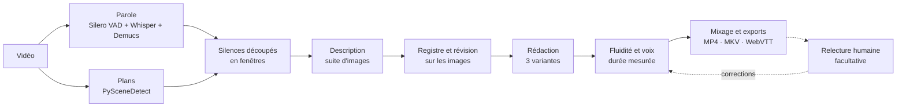

# Audesia

**Audiodescription automatique en français, 100 % locale.**

Audesia ajoute une piste d'audiodescription française à une vidéo. Il repère les silences entre les dialogues, décrit ce qui se passe à l'écran avec un modèle de vision, réécrit chaque description pour qu'elle tienne dans le silence, puis la fait lire par une voix de synthèse mixée à la bande-son. Une fois les modèles téléchargés, tout tourne hors ligne : aucune vidéo ne quitte la machine.

> Projet candidat au **ASUS Ascent GX10 – Local AI Developer Challenge**.
> État : prototype initial, un script de bout en bout ([`audesia_p0.py`](audesia_p0.py)) et sa page de relecture, testés sur RTX 5080 sur un corpus de 74 min : voir [Résultats](#résultats).

## Pourquoi

- En France métropolitaine, environ 1,7 million de personnes ont une déficience visuelle, dont 1,1 million avec une incapacité visuelle sévère ([DREES, 2005](https://drees.solidarites-sante.gouv.fr/publications/etudes-et-resultats/les-personnes-ayant-un-handicap-visuel-les-apports-de-lenquete), d'après l'enquête HID de 1998-2000). Selon la [Fédération des Aveugles de France (2019)](https://aveuglesdefrance.org/app/uploads/2021/03/CP_Aveugles-de-France-au-festival-off-avignon-11-juillet-2019.pdf), seulement 4 % des émissions de télévision sont audiodécrites, et l'audiodescription reste rare en ligne.
- Une audiodescription professionnelle (auteur, comédien, studio) se justifie pour un film, pas pour un cours filmé, une formation interne ou la chaîne d'une association.
- Les outils d'IA existants sont des services cloud : ils sont exclus pour les vidéos internes, non publiées ou soumises au RGPD.

Audesia s'adresse aux médiathèques, universités, collectivités, entreprises et créateurs qui veulent audiodécrire leurs vidéos sur site, sans coût à la minute. L'audiodescription générée doit être relue avant diffusion : elle ne remplace pas le travail d'un audiodescripteur professionnel quand le budget le permet.

## Comment ça marche

1. **Parole** : Silero VAD repère la parole. Les segments de Whisper large-v3 au débit plausible s'y ajoutent, ce qui rattrape les répliques chuchotées. La voix, isolée de la musique par Demucs, ajoute les cris et les souffles brefs. Le reste forme les silences utilisables. La transcription sert aussi de contexte au rédacteur.
2. **Plans** : PySceneDetect découpe la vidéo aux changements de plan.
3. **Fenêtres** : chaque silence long est découpé en fenêtres de 5 à 10 s, coupées aux changements de plan. Chaque fenêtre reçoit une description.
4. **Description** : un modèle de vision décrit la suite d'images de la fenêtre (jusqu'à 4), sans autre contexte. Il dit les actions, nomme les objets quand ils sont reconnaissables et décrit les états visibles.
5. **Registre et révision** : sur l'ensemble de l'extrait, le modèle établit un registre des personnages (une désignation stable et des traits visuels pour chacun). Il révise ensuite chaque description sur ses images, avec le registre et les plans voisins : une même personne garde la même désignation, chaque action est rattachée au bon personnage, et rien de ce que les images ne montrent pas n'est gardé.
6. **Rédaction** : le même modèle réécrit chaque description en trois variantes de longueurs décroissantes, selon les règles de l'audiodescription.
7. **Voix** : une passe de fluidité remplace une désignation déjà dite par « elle », « il » ou une forme courte, et écarte les redites. Chaque variante est ensuite synthétisée et mesurée ; la plus longue qui tient dans le silence est retenue. Chaque phrase est retranscrite par Whisper : si elle est dite trop vite ou qu'un mot y manque, elle est resynthétisée, jusqu'à 3 essais.
8. **Mixage** : la bande-son est atténuée sous la voix, puis exportée.
9. **Relecture (facultative)** : dans une page web locale, un humain écoute, corrige ou supprime les descriptions de son choix ; seules les phrases changées sont resynthétisées, puis tout est remixé.



Cinq principes :

- **Jamais sur un dialogue.** La détection de parole est réglée pour être sensible, avec une marge autour de chaque réplique : dans le doute, c'est de la parole. Une assertion fait échouer le traitement si une description chevauche une parole détectée.
- **Calage sur la durée réelle de la voix**, pas sur une estimation du débit. Si aucune variante ne tient, la plus courte peut être accélérée de 10 % au plus ; sinon la description est abandonnée et signalée dans la fiche de relecture.
- **Règles de l'audiodescription française.** Les consignes suivent la *Charte de l'audiodescription* (2008) : présent, troisième personne, uniquement ce qui est visible, pas d'interprétation, un personnage n'est nommé qu'une fois son nom prononcé ou affiché.
- **Ne rien inventer, garder les mêmes personnages.** Le modèle de vision ne voit que les images, et une révision confronte chaque description à ses images. Un registre fixe la désignation de chaque personnage pour toute la vidéo, et une passe de fluidité évite de la répéter. Une relecture humaine, facultative, corrige ce qui reste.
- **Mesurer chaque exécution.** Durée par étape, couverture des silences, débit de la voix et mémoire sont enregistrés dans `metrics.json`.

## Démarrage rapide

Prérequis : Linux, WSL2 ou Windows, GPU NVIDIA (testé sur une RTX 5080 16 Go sous Windows), Python 3.12, ffmpeg. Environ 25 Go de modèles sont téléchargés au premier lancement ; ensuite, `HF_HUB_OFFLINE=1` interdit tout appel au Hub, ce qui est le cas d'office sous Docker.

Les commandes ci-dessous sont pour Linux. Sous Windows, installez ffmpeg (winget ou scoop) et l'application Ollama, avec un contexte d'au moins 8 192 jetons dans ses réglages, puis les mêmes paquets pip dans un environnement virtuel.

```bash
sudo apt install ffmpeg sox
pip install torch torchaudio --index-url https://download.pytorch.org/whl/cu128
pip install qwen-tts silero-vad scenedetect openai
curl -fsSL https://ollama.com/install.sh | sh
```

Le modèle de vision est servi par Ollama, avec un contexte élargi pour accepter 4 images par requête :

```bash
OLLAMA_CONTEXT_LENGTH=8192 ollama serve &
ollama pull gemma4:26b-a4b-it-qat
```

Audiodescription de la scène de la hutte dans *Sintel*, où un vieil homme recueille la jeune femme :

```bash
wget https://download.blender.org/durian/movies/Sintel.2010.1080p.mkv
python audesia_p0.py Sintel.2010.1080p.mkv --start 1:35 --end 3:35
```

Le [doublage français de Sintel par Touhoppai](https://peertube.touhoppai.moe/w/tZbHhmpfbC8vt2rw871P7A) (CC BY) fonctionne aussi ; ses horaires diffèrent de ceux de la version originale.

Pour vérifier la logique de calage sans GPU :

```bash
python audesia_p0.py --selftest
```

### Sorties

Les fichiers sont écrits dans `out/<vidéo>_<début>-<fin>/` :

| Fichier | Contenu |
| --- | --- |
| `clip.mp4`, `clip_ad.mp4` | L'extrait sans et avec audiodescription |
| `clip_ad.mkv` | Deux pistes audio : l'originale et l'audiodescription, marquée pour les personnes malvoyantes ; descriptions en sous-titres WebVTT |
| `ad.vtt`, `ad.json` | Descriptions retenues, horodatées |
| `relecture.html` | Page de relecture, à ouvrir dans un navigateur, hors ligne |
| `relecture.json` | Fiche de relecture : horaire, place disponible, texte lu, durée de la voix et statut de chaque fenêtre |
| `segments.json`, `shots.json`, `descriptions.json`, `personnages.json` | Étapes intermédiaires, mises en cache |
| `metrics.json` | Durée par étape, couverture des silences, débit mesuré de la voix, synthèses refaites, requêtes et jetons par modèle, faits vérifiés et écartés, pic mémoire |

Les étapes coûteuses sont mises en cache. Supprimer `descriptions.json` relance la description, le registre, la révision et la rédaction ; changer de voix ne refait que la voix et le mixage.

### Relecture (facultative)

Ouvrir `relecture.html`, dans le dossier de sortie, avec un navigateur. La page fonctionne hors ligne, sans serveur.


*Relecture de l'extrait de* Sintel *en version française : la ligne surlignée est celle de la scène en cours. Image : Sintel © Blender Foundation (CC BY 3.0), doublage Touhoppai (CC BY).*

Elle réunit :

- la vidéo avec ou sans audiodescription, en gardant la position ; la description en cours s'affiche sous l'image ;
- pour chaque silence : l'horaire (un clic lance la scène), le texte lu, modifiable, la durée de la voix sur la place disponible, le statut, la description factuelle et les variantes du modèle ;
- les boutons Écouter, Supprimer et Rétablir ; pendant la saisie, la durée de la voix est estimée, et un texte trop long est signalé avec le nombre de caractères à retirer ;
- l'accès au clavier et au lecteur d'écran, avec des raccourcis affichés sur la page.

« Enregistrer les corrections » écrit `corrections.json` : directement dans le dossier choisi sous Chrome et Edge, sinon dans les téléchargements. Il reste à relancer la commande affichée sur la page. « Régénérer » attend le serveur local du P1.

Sans navigateur, `relecture.json` donne les mêmes informations, et l'on écrit soi-même dans `corrections.json` les seuls textes à changer, avant de relancer la même commande :

```json
{
 "d_0004": "Elle regarde sous les débris.",
 "d_0007": ""
}
```

- Un texte relu est lu tel quel, sans la passe de fluidité. Une chaîne vide laisse la fenêtre silencieuse.
- Un texte qui ne tient pas dans son silence (accélération de 10 % comprise) n'est pas placé. `relecture.json` indique alors combien de caractères retirer.
- Seules les phrases modifiées sont synthétisées, car les autres sont en cache. Tout est ensuite remixé. Sur la 5080, une relance prend 10 s sans changement, et environ 1 min 15 s pour quatre phrases corrigées, chargement du modèle de voix compris.

En P1, un serveur local servira la même page, relancera lui-même la voix et le mixage, et régénérera une description à la demande.

### Options utiles

| Option | Rôle |
| --- | --- |
| `--start`, `--end` | Bornes de l'extrait (`mm:ss`) |
| `--profile` | `small` par défaut (RTX 5080 : un modèle servi par Ollama), `large` (GX10 : deux serveurs vLLM) ou chemin d'un fichier TOML ; voir [configs/](configs/) |
| `--cps` | Débit de la voix en caractères par seconde ; reprendre `measured_chars_per_s` de `metrics.json` |
| `--voice` | Voix Qwen3-TTS : Vivian (par défaut), Serena, Ryan, Aiden… |
| `--tts-model` | `Qwen/Qwen3-TTS-12Hz-0.6B-CustomVoice` si la mémoire vidéo manque |

Pour comparer des rédacteurs, supprimer `descriptions.json` et relancer : la vision (descriptions brutes, détails agrandis, registre des personnages) est reprise de `vision.json`, et seules la révision, la rédaction, la voix et le mixage sont refaits. Sur *Sprite Fright*, cela ramène le run de 35 à 21 min.

### Sur le GX10 (profil `large`)

Tout tourne sous Docker, sur un réseau interne sans accès sortant :

- deux serveurs vLLM : Qwen3.6-35B-A3B (FP8) décrit les plans, Gemma 4 26B-A4B (NVFP4) relit chaque description sur les images puis rédige ;
- l'image du pipeline (transcription, voix, mixage), construite sur l'image vLLM. Elle en hérite CUDA 13 et PyTorch, pour arm64 comme pour amd64, et partage ses couches avec elle. Elle n'apporte que les dépendances : le code vient du dépôt, monté dans le conteneur, et le modifier ne demande pas de reconstruire l'image.

Les descriptions partent en parallèle, 8 requêtes à la fois, et vLLM les regroupe en lots.

```bash
scripts/docker.sh fetch gx10   # une fois, avec internet : environ 64 Go de modèles
scripts/docker.sh build        # image du pipeline, construite sur place en arm64
scripts/docker.sh start gx10   # vision puis rédacteur, l'un après l'autre
scripts/docker.sh run Sintel.2010.1080p.mkv --start 1:35 --end 3:35 --profile large
scripts/docker.sh stop
```

**Le jour 1 en une commande.** `scripts/jour1.sh` enchaîne tout :
- les modèles et l'image du pipeline, une seule fois ;
- les serveurs, puis le corpus en profil `large` ;
- le juge `small` contre `large` (Qwen3.5-122B, seul sur la machine) et l'échantillon d'hallucinations ;
- le rapport, puis l'archive.

Il se relance après un arrêt : chaque étape faite est sautée, et un juge qui ne démarre pas n'empêche ni le rapport ni l'archive. La chronologie de la journée va dans `out/jour1.log`. Avant, copier sur le GX10 le corpus, le précalcul de la 5080 et les résultats `small`, soit environ 7 Go :

```bash
tar cf gx10.tar corpus/media out/corpus/commun $(find out/corpus/small -name "*.json")  # sur la 5080
tar xf gx10.tar && scripts/jour1.sh                                                       # sur le GX10, dans le dépôt
```

Le rapport donne alors la mémoire de l'hôte au plus haut, étape par étape : chaque étape du pipeline est horodatée dans `metrics.json`, et `eval/report.py` y rattache le relevé de `out/memoire.csv`.

Pour mesurer le débit, `--jobs 2` traite deux vidéos à la fois, chacune avec son journal (`out/corpus/<profil>/<vidéo>.log`). Chaque pipeline en plus ajoute 6 à 8 Gio. Pour ne pas reprendre le run du jour 1, il faut lui donner un autre nom de profil :

```bash
cp configs/large.toml configs/large-x2.toml
python3 eval/run_corpus.py --profile large-x2 --docker --jobs 2
```

Chaque run vérifie qu'aucune connexion sortante n'aboutit, et le note dans `metrics.json` (`"outbound_network": false`) : c'est la preuve du 100 % local. Ce réseau fermé a déjà servi. Il a révélé un appel caché à l'API de Hugging Face, que transformers faisait à chaque chargement de la voix ; cet appel est désormais neutralisé.

`start gx10` lance aussi `scripts/bench_memory.sh`, qui relève la mémoire de l'hôte chaque seconde dans `out/memoire.csv` : sur le GB10, `nvidia-smi` n'affiche pas la mémoire. C'est aussi un garde-fou. Deux serveurs sur la mémoire unifiée ont déjà fait geler un GB10 au démarrage, et une machine gelée ne se redémarre pas à distance. Le script arrête donc les serveurs si la mémoire disponible passe sous 8 Gio.

Le tout se teste avant sur une carte de 16 Go, avec Qwen3.5-2B, de la même famille que Qwen3.6. `HF_CACHE` monte un cache Hugging Face qui contient déjà la transcription et la voix (sous Windows, un chemin du type `C:/Users/<vous>/.cache/huggingface`) :

```bash
scripts/docker.sh fetch 5080 && scripts/docker.sh build && scripts/docker.sh start 5080
HF_CACHE=~/.cache/huggingface scripts/docker.sh run Sintel.2010.1080p.mkv --start 1:35 --end 2:00 --profile test-vllm
```

Testé sur la 5080 le 4 octobre :

- le pipeline complet tourne hors ligne dans son conteneur, en 2 min 37 s pour 25 s de vidéo, dont 46 s de transcription et 86 s de voix ;
- les images, le JSON, la réflexion coupée et les lots de requêtes fonctionnent : 4 requêtes simultanées prennent 0,8 s, contre 2,3 s en série.

Qwen3.5-2B est en revanche trop petit pour bien décrire : ce test valide le chemin, pas la qualité.

## Pourquoi le GX10

| | RTX 5080 (16 Go) | ASUS Ascent GX10 (128 Go unifiés) |
| --- | --- | --- |
| Vision | Gemma 4 26B-A4B, 4 bits, en partie sur le CPU | Qwen3.6-35B-A3B FP8, jusqu'à 122B en comparaison |
| Rédaction et vérification | Le même modèle | Gemma 4 26B-A4B dédié, jusqu'à 120B en comparaison |
| Modèles chargés | En partie l'un après l'autre | Tous en même temps, 2 à 3 vidéos en parallèle |

Le GX10 a moins de bande passante mémoire que la 5080 (environ 273 contre 960 Go/s). Son intérêt est la capacité : toute la chaîne reste chargée, plusieurs vidéos passent en parallèle, et des modèles de classe 120B peuvent être comparés pour choisir les modèles par la mesure. Pour limiter l'effet de la bande passante, Audesia s'appuie sur des modèles MoE et sur le traitement en lot (vLLM). Sur la 5080, un premier constat est déjà mesuré : le modèle de 12B invente des détails, et celui de 26B, qui décrit juste, déborde sur le CPU. Le gain apporté par des modèles plus grands encore reste à mesurer sur le GX10.

## Plan de test

Les deux profils traitent le même corpus avec les mêmes entrées audio et visuelles :

| Mesure | Méthode | Objectif |
| --- | --- | --- |
| Chevauchement des dialogues | Contre la parole détectée, puis contre une vérité terrain : pistes musique + effets sans dialogues de *Sintel* et *Tears of Steel*, retranchées du mixage fréquence par fréquence | 100 % par construction ; > 95 % contre la vérité terrain |
| Couverture | Part des silences utilisables qui reçoit une description | À mesurer |
| Qualité | Comparaison par paires à l'aveugle, juge VLM extérieur aux deux chaînes, échantillon humain | Gain net du GX10 |
| Hallucinations | Vérification humaine des mêmes 100 descriptions pour les deux profils | Taux comparé |
| Temps de traitement | Minutes de calcul par minute de vidéo | < 5 |
| Mémoire | Relevé à 1 Hz sur l'hôte, par étape | Marge mesurée |
| Hors ligne | Traitement complet dans un réseau Docker sans accès sortant | Réussi |

Corpus (74 min, dont 64 % en français) : *Sintel* en version originale et en version française, *Tears of Steel* en version originale anglaise, *Sprite Fright* et *Pepper&Carrot* (épisode 6) en version française, *Le trésor de Sidiailles*. *Sintel* (VO et VF) et *Tears of Steel*, 44 min en tout, ont une piste musique + effets : retranchée du mixage fréquence par fréquence, elle donne une vérité terrain exacte. Le détail est dans [corpus/corpus.toml](corpus/corpus.toml) et [AUDESIA.md](AUDESIA.md).

```bash
python corpus/download.py                    # environ 3,3 Go, dans corpus/media/
python eval/run_corpus.py --precompute       # extrait, parole et plans, une fois pour tous les profils
python eval/run_corpus.py --profile small    # sur la 5080 ; sur le GX10 : --profile large --docker
python eval/report.py                        # rapport chiffré, un tableau par profil : out/corpus/rapport.md
```

Une étape déjà faite est sautée : un traitement interrompu reprend là où il s'était arrêté.

La qualité se compare sur les mêmes silences, à l'aveugle, une fois les deux profils passés :

```bash
python eval/judge.py out/corpus/small out/corpus/large                 # juge VLM : notes et meilleure description
python eval/judge.py out/corpus/small --judge configs/judge-5080.toml  # notation seule, sur la 5080
python eval/hallucination_sample.py out/corpus/small out/corpus/large  # 100 silences à vérifier à la main
python eval/hallucination_sample.py out/corpus/small                   # ou ceux d'un seul profil
python eval/hallucination_sample.py --score out/corpus/reponses_small_vs_large.json  # taux par profil
```

- **Juge :** un VLM absent des deux chaînes comparées (sur le GX10, Qwen3.5-122B-A10B : `scripts/docker.sh start juge`, puis `scripts/docker.sh py eval/judge.py …`). Pour chaque silence, il voit 6 images du plan et les deux descriptions, dans un ordre tiré au sort. Il note chacune de 1 à 5 (exactitude, pertinence, cohérence des personnages, concision) et désigne la meilleure. Avec un seul run, il note ses descriptions sans comparaison et liste les moins exactes ; sur la 5080, Qwen3.6 sous Ollama, absent du profil `small`, tient ce rôle.
- **Hallucinations :** la page `hallucinations_….html` montre chaque silence tiré au sort en vidéo, avec ses descriptions : fidèle, invente ou se trompe, ou je ne sais pas. Elle ne contient pas le nom des profils ; la correspondance reste dans le `.json` du même nom jusqu'au comptage. Chaque tirage a ses propres fichiers, réponses comprises : un nouveau tirage n'écrase pas les réponses d'un autre.
- `report.py` reprend les tableaux du juge et des hallucinations.

## Résultats

### Corpus complet (5 octobre 2026)

Profil `small` sur RTX 5080, sur les 6 vidéos du corpus (74 min), en une nuit : 8 h 24 de bout en bout, dont 1 h 30 perdue sur une erreur corrigée en route, puis 1 h 34 pour le juge. Les résultats texte sont archivés dans [results/](results/) ; *Le trésor de Sidiailles* n'y figure que par ses chiffres, à cause des enfants à l'écran.

| Vidéo | Placées | Couverture | Sans chevauchement des répliques | Sans chevauchement d'aucune voix | Musique retirée du résidu | Calcul par minute de vidéo | Exactitude (juge) | Pertinence (juge) |
| --- | --- | --- | --- | --- | --- | --- | --- | --- |
| *Sintel*, VO | 113 sur 115 | 73 % | 108 sur 113 (96 %) | 88 sur 113 (78 %) | 15,1 dB | 9,2 min | 4,32 | 3,54 |
| *Sintel*, VF | 94 sur 97 | 72 % | 92 sur 94 (98 %) | 79 sur 94 (84 %) | 21,0 dB | 6,2 min | 4,31 | 3,60 |
| *Tears of Steel* | 75 sur 79 | 71 % | 74 sur 75 (99 %) | 72 sur 75 (96 %) | 14,0 dB | 5,3 min | 4,52 | 3,69 |
| *Sprite Fright*, VF | 32 sur 35 | 69 % | — | — | — | 3,4 min | 3,91 | 3,28 |
| *Pepper&Carrot* 6, VF | 26 sur 26 | 78 % | — | — | — | 4,0 min | 4,46 | 3,54 |
| *Le trésor de Sidiailles* | 79 sur 81 | 69 % | — | — | — | 6,9 min | 4,13 | 3,35 |
| **Total** | **419 sur 433** | **72 %** | **274 sur 282 (97 %)** | **239 sur 282 (85 %)** | | **6,1 min** | **4,29** | **3,53** |

- **Dialogues respectés.** Contre la vérité terrain (*Sintel* VO et VF, *Tears of Steel* : 44 min), 274 descriptions sur 282 (97 %) ne chevauchent aucune réplique : l'objectif de 95 % est atteint. Les 8 autres débordent de 1,2 s au plus, sauf une de 1,95 s : dans la scène du bébé dragon de *Sintel*, Silero entend une voix dans le résidu, que la détection du pipeline, faite sur le mixage complet, a manquée. Au critère strict, cris et souffles compris, c'est 85 %.
- **Vérité terrain : soustraction fréquence par fréquence.** Les pistes musique + effets ne correspondent au mixage final qu'à une égalisation près. Retranchées avec un gain unique, elles ne retiraient que 1,7 dB de musique de *Tears of Steel* et 6,8 dB de *Sintel* VO. Avec un gain complexe par fréquence, estimé par tranches de 30 s, elles en retirent 14 et 15,1 dB.
  - La vérité terrain de *Tears of Steel* devient exploitable : 97 % de son temps de parole tombe dans les sous-titres, et elle couvre 70 % de leur durée, contre 46 % avant.
  - Plus propre, elle est aussi plus sévère. Au critère strict, *Sintel* VO passe de 89 à 78 % : des souffles et les cris du bébé dragon, auparavant noyés dans la musique, ressortent. Une part peut aussi venir de restes de musique dans les passages les plus forts, où le résidu dépasse d'environ 3 dB le reste attendu.
- **Temps.** 6,1 min de calcul par minute de vidéo en moyenne, de 3,4 à 9,2 selon la densité des silences, pour un objectif de 5 sur le GX10. Le processus Python plafonne à 8 Gio de mémoire GPU pour la voix et la transcription, et Gemma 26B, qui occupe le reste de la carte, déborde sur le CPU.
- **Qualité, selon le juge.** Qwen3.6 35B sous Ollama, absent de la chaîne `small`, note chaque description sur 6 images de sa fenêtre. Les descriptions sont justes et bien écrites : exactitude 4,29 sur 5, cohérence des personnages 4,76, concision 4,67. Mais elles omettent souvent l'action principale : pertinence 3,53. 45 descriptions sur 419 (11 %) n'ont que 1 ou 2 sur 5 en exactitude.
- **Ce qui échoue, d'après ses raisons :**
  - les actions lues sur des images fixes : « ensevelie sous la neige » au lieu de « se relève », la même erreur en VO et en VF ; « s'éloigne » au lieu de « se rapproche » ;
  - les personnages confondus : un homme brun à la place de la jeune femme rousse, « elle » pour un homme ;
  - les fenêtres qui enchaînent deux plans : la variante courte garde parfois le premier, très bref. Ainsi « Une cassette « VEEJAY » entre dans un lecteur » décrit une seconde de gros plan, au lieu de la jeune fille qui affronte les champignons pendant les six suivantes. Donner au réviseur et au rédacteur la durée de chaque plan corrige ce cas, mais pas la pertinence d'ensemble : à l'aveugle sur *Sprite Fright*, l'ancienne rédaction l'emporte 8 fois contre 5 sur les 26 fenêtres à plusieurs plans, pertinence inchangée (3,42 contre 3,44). Le changement n'est pas retenu ;
  - les génériques : couleur du fond fausse, crédits omis ;
  - les descriptions trop courtes : « Une poule. », « L'homme menace. ».
- **Le juge n'est pas infaillible.** Il qualifie parfois de « totalement fausse » une description juste sur une partie de la fenêtre, et ne voit que 6 images.
- **Hallucinations, vérifiées à la main : 48 %.** Sur 100 silences tirés au sort et regardés en vidéo, à l'aveugle, 43 descriptions sur 89 jugées inventent ou se trompent (de 38 à 59 % à 95 % de confiance). Le critère est strict : une seule erreur suffit. Les notes du relecteur montrent surtout :
  - des actions mal lues sur des images fixes : « gît sur le sol » au lieu de « suit la jeune femme », « est au sol » au lieu de « se lève » ;
  - l'action principale manquée : « Une main tient un journal froissé » pour un homme qui dort, un journal sur le visage ; « La créature court » quand la petite fille lance des bretzels aux créatures ;
  - des êtres et des objets mal reconnus : une « chauve-souris » pour le petit dragon, un « tissu sombre » pour une planche ;
  - une action prêtée à une main anonyme plutôt qu'au personnage : « une main brandit une dague face à elle » quand elle s'avance, une dague à la main.

  Le juge VLM n'en jugeait que 11 % grossièrement fausses (2 sur 5 ou moins en exactitude) : il sous-estime nettement les erreurs, et l'échantillon humain reste la mesure de référence. 9 réponses portent une note sans verdict et ne sont pas comptées. Réponses et comptage : `results/reponses_small.json`, `results/hallucinations_small.md`.
- **Hors ligne.** Ce run tournait sous Windows, hors du réseau Docker sans sortie : la preuve hors ligne reste celle du run sous Docker (section [Sur le GX10](#sur-le-gx10-profil-large)).

### Extrait de *Sintel* (4 octobre 2026)

Mesures du prototype sur RTX 5080 (16 Go), le 4 octobre 2026 : *Sintel*, de 1:35 à 3:35, en version originale et dans le doublage français de Touhoppai. L'extrait contient 12 répliques séparées de silences courts, un long passage musical, puis des répliques chuchotées.

| Mesure | Version originale | Doublage français |
| --- | --- | --- |
| Descriptions placées | 13 sur 13 | 10 sur 10 |
| Sans chevauchement des répliques, chuchotements compris | **13 sur 13 (100 %)** | **10 sur 10 (100 %)** |
| Sans chevauchement d'aucune voix (répliques, cris, souffles) | 10 sur 13 (77 %), au plus 0,66 s | 5 à 6 sur 10 selon les runs, au plus 1 s |
| Couverture des silences utilisables | 68 % | 76 % |
| Fiabilité de la vérité terrain (musique atténuée dans le résidu) | 6,9 dB | 15,8 dB |

Avec les cris et les souffles détectés par Demucs, activés depuis, la VF passe à 7 descriptions sur 9 sans chevauchement d'aucune voix (chevauchement maximal : 0,68 s), pour une couverture de 64 % au lieu de 76 % (un run).

- **Modèle de vision et de rédaction :** Gemma 4 26B-A4B (4 bits). Il ne tient pas en entier dans 16 Go : Ollama en place une partie sur le CPU.
- **Temps de calcul :** 15 à 27 min pour 2 min de vidéo selon la charge du GPU (objectif : moins de 5 min par minute). La description, le registre et la révision en prennent 11 à 23 ; ce dépassement vient de la partie du modèle placée sur le CPU.
- **Mémoire GPU :** pic de 10,5 Gio dans le processus Python pendant la transcription ; le modèle de vision est libéré avant la voix.

**Choix du modèle, mesuré sur les mêmes images.** Sur les 7 plans de la seconde partie, vérifiés un à un à l'image :

- Gemma 4 12B inventait un homme qui saisit Sintel, un « livre taché de sang » (les ailes du dragon) et une hache.
- Qwen3.6 35B-A3B décrivait juste 6 plans sur 7, mais inventait une personne sur le septième.
- Gemma 4 26B-A4B décrivait juste 6 plans sur 7 sans rien inventer, avec seulement une couleur de cheveux fausse et une ville omise.

Sur 16 Go, le modèle qui décrit juste ne tient donc déjà plus en mémoire.

**Vérité terrain.** La piste musique + effets officielle de *Sintel* est soustraite du mixage, après calage par corrélation (à 5 ms près) et ajustement du gain. La parole est détectée dans ce résidu par Silero VAD, puis recoupée par l'énergie de la bande vocale. Les sous-titres restent affichés jusqu'à 2 s après la fin de la parole : mesuré contre eux, un premier jeu de descriptions ne passait qu'à 56 %.

```bash
wget https://download.blender.org/durian/movies/sintel-m+e-st.flac
python eval/overlap.py out/Sintel.2010.1080p_1.35-3.35 --video Sintel.2010.1080p.mkv --me sintel-m+e-st.flac --start 1:35 --end 3:35
```

**Ce que les mesures ont corrigé :**

- Les horodatages de Whisper débordaient sur la musique et effaçaient le passage de 51 s sans dialogue : seuls ses segments au débit plausible sont gardés.
- Les cris et les souffles passaient entre les mailles. La voix isolée par Demucs en repère désormais l'énergie : sur l'extrait VF, 7 descriptions sur 9 ne touchent plus aucune voix, contre 5 sur 10, au prix de 12 points de couverture.
- La VAD manquait les répliques chuchotées du doublage (« C'est bientôt fini », « Ne bouge pas ») : ces segments Whisper, élargis de 0,5 s, les protègent désormais.
- Sur les films entiers, Whisper hallucine pendant la musique (« I'm sorry » en boucle sur 131 s de Sintel) : ces boucles auraient effacé des silences. Un texte qui se compresse plus de 2,4 fois, critère de Whisper lui-même, est désormais écarté.
- Le modèle de vision recevait en contexte les répliques (« Cette lame… ») et les descriptions précédentes, ce qui amorçait des inventions. Il ne voit plus que les images, et une passe de vérification confronte sa description aux images.
- Une même personne devenait deux ou trois personnages (« rousse », « cheveux roses », « cheveux longs et clairs »), et une main restait « sombre » et anonyme. Un registre des personnages, puis une révision de chaque description sur ses images avec les plans voisins, fixent désormais une désignation unique. En VF : « la jeune fille aux cheveux roux » et « le petit dragon », et « elle tend une main gantée vers le dragon blessé ».
- Les actions se perdaient (« accroupie sur un toit »). La consigne demande désormais la suite des actions et des objets nommés précisément : « Elle grimpe sur les façades et s'accroupit sur un toit rouge ».
- Un exemple concret dans la consigne (« une pomme ») a fait écrire « une pomme rouge » à la place d'un fruit à piquants. La consigne n'a plus d'exemple et demande de ne pas remplacer un objet ambigu par un objet familier.
- La désignation complète revenait à chaque plan. Une passe de fluidité la remplace par « elle » ou une forme courte, et écarte les redites (« Elle tend sa main gantée vers le dragon blessé », dit deux fois de suite).
- À contre-jour, des débris passaient pour un « tissu noir ». Une image à grande zone sombre sur fond clair est désormais aussi envoyée éclaircie ; le modèle y voit « un morceau de bois sombre ».
- Un petit objet restait « un objet sphérique ». Quand la description reste vague, une question directe porte sur trois détails agrandis en pleine résolution ; sur l'image centrale du plan, le modèle reconnaît alors « un fruit épineux ».

**Limites observées :**

- Des éclats de voix brefs passent encore entre les mailles, moins souvent : sur l'extrait VF, 2 descriptions sur 9 en touchent un, 0,68 s au plus. La Charte demande de ne pas couvrir ces sons. Les repérer coûte de la couverture : 64 % au lieu de 76 %.
- La reconnaissance du fruit reste fragile. Sur trois images agrandies du même plan, le modèle répond « un fruit épineux », « un gant à pointes » ou « rien d'identifiable », et un même run peut basculer vers « une sphère épineuse ». C'est la limite de reconnaissance d'un modèle de 26B en 4 bits.
- Éclaircie, la masse sombre devient bien un morceau de bois, mais la posture est lue comme « elle se cache derrière » au lieu de « elle regarde dessous ». L'action se lit dans le mouvement, pas sur des images fixes.
- Quand deux personnages ont le même genre (en VO : « la jeune femme » et « la petite créature ailée »), le rédacteur écrit encore des « elle » ambigus (« Elle sourit, elle crie »).
- Le registre oublie les personnages secondaires : le vieil homme de la hutte n'y figure pas.
- Une vérification fait par fait sur les images existe en option (`verify` dans le profil). Sur l'extrait VF, elle a écarté 19 faits sur 117 : à raison la jeune fille d'un plan où seul le dragon est visible, mais à tort la main gantée tendue vers le dragon, action clé du plan, tout en gardant un « sol pavé » sur un toit. Elle reste désactivée en attendant un A/B sur le GX10, avec un juge.
- Avec 8 images par plan, la suite des actions était mieux suivie (« elle brandit un couteau »), mais la description prenait 50 min sur la 5080.
- La voix de synthèse précipite parfois une phrase : 19 à 20 caractères par seconde au lieu de 10 à 15, et un mot avalé (« sur un toit » retranscrit « sur un C »). Le script retranscrit désormais chaque phrase, et la refait, jusqu'à 3 essais, si elle est dite à plus de 16 caractères par seconde ou qu'un mot de plus de 3 lettres manque à sa retranscription. Sur les 10 phrases de la VF, ce contrôle n'a rejeté aucune phrase à tort et ajoute environ 40 s à la voix.

**Essai du juge** sur le doublage, version relue contre version automatique, avec Qwen3.6 35B, absent de ces deux runs en Gemma, sur 10 silences :

- il donne raison à la relecture sur l'invention nette : « elle se cache derrière un bois sombre » obtient 2 sur 5 en exactitude, et la correction « elle regarde sous les débris », 4 ;
- mais il préfère les formulations prudentes : « une sphère épineuse » plutôt que « un fruit », et la version sans le couteau, peu net sur ses 6 images ;
- sa note d'exactitude mesure donc ce qui se vérifie sur les images, pas ce que sait un spectateur du film. D'où l'échantillon vérifié à la main, à côté.

Ces défauts sont les cibles des modèles plus grands du GX10, où le modèle tient en entier en mémoire et où 8 images par plan restent abordables. En attendant, la relecture humaine les corrige : sur le doublage, quatre phrases corrigées (débris, fruit, couteau, main) ont été resynthétisées et remixées en 1 min 15 s environ. Mesurée contre la piste musique + effets, cette version relue ne chevauche aucune réplique. Au critère strict (cris, souffles), elle fait comme la version automatique : 5 sur 10.

## Feuille de route

- **P1** : pipeline modulaire avec reprise, vérification de chaque fait sur l'image, comparatif de voix, une page web pour tout faire sans ligne de commande (dépôt, suivi, relecture, export), à partir de la page de relecture du P0, déploiement Docker ARM64.
- **P2**, sur le GX10 : mesures de mémoire et de débit, comparaison de modèles de classe 120B.
- **Ensuite** : tests avec des utilisateurs aveugles et malvoyants, mode étendu où la vidéo se met en pause (WCAG 1.2.7), autres langues.

Le brief complet (contraintes, architecture, choix techniques, risques) est dans [AUDESIA.md](AUDESIA.md).

## Licences et crédits

- Code : Apache-2.0, voir [LICENSE](LICENSE).
- Modèles et outils, téléchargés au premier lancement et non redistribués : Gemma 4, Qwen3-TTS (Apache-2.0) ; Whisper, Silero VAD (MIT) ; PySceneDetect (BSD-3) ; ffmpeg (LGPL/GPL).
- Hybrid Demucs (torchaudio) : code MIT ; ses poids ont été entraînés sur MUSDB18-HQ, un jeu de données réservé à la recherche, plus 150 morceaux internes de Meta. À vérifier avant tout usage commercial.
- *Sintel* © Blender Foundation, [durian.blender.org](https://durian.blender.org), CC BY 3.0. Doublage français : Touhoppai, CC BY.
- Aucune vidéo générée n'est versionnée dans ce dépôt.
